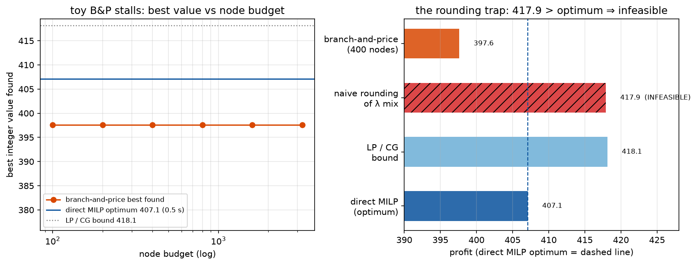

# Phase 1 — Lesson 1.10: Branch-and-Price — CG Inside Branch-and-Bound

Evidence: `docs/research/phase1_lesson10_branch_price_evidence.txt` (live run).
Demo: `phase1_milp/lesson1_10_branch_and_price.py`.

Lesson 1.9 ended with a doorway: *integer* blocks break DW's optimality
claim, because the master's λ-solution can be fractional and no rounding
of it is both feasible and optimal. **Branch-and-Price (Barnhart et al.
1998)** is the honest fix: branch-and-bound on the original variables,
with column generation re-run at every node of the tree. This lesson
builds the smallest working version and measures everything against a
direct MILP ground truth.

## 1. The setup (6 blocks × 10 binary activities, 2 shared resources)

The block structure of 1.9 with `x ∈ {0,1}`: each block is a knapsack.
Five methods, one table:

| method | value | time | note |
|---|---|---|---|
| (a) direct MILP (gap 0) | **407.100** | 0.48 s | ground truth |
| (b) direct LP relaxation | 418.126 | — | integrality gap 2.71% |
| (c) DW master LP (CG) | 410.205 | 0.51 s | **same bound as (b)** in 23 columns vs 60+ variables — CG compressed the formulation |
| (d) naive rounding of λ | 417.9 | — | **INFEASIBLE** — global resources violated |
| (e) branch-and-price | 397.600 | 11.2 s | −2.33% after 400 nodes (toy DFS) |

## 2. The two traps, verified live

*Left: the stall made visible — B&P's best integer value stays flat at
397.6 across node budgets 100→3200 while the direct MILP proves 407.1 in
0.5 s and the LP/CG bound sits at 418.1. Right: the five methods as bars —
the hatched bar is the rounding trap: 417.9 > the optimum ⇒ **infeasible**
(the dashed line is the true optimum). Generated by
`phase2_mdp/make_figures_110.py` (same instance and seeds as the table).*

1. **(d) is the lesson's centerpiece:** rounding the fractional λ mix gave
   profit 417.9 — *higher than the optimum*, i.e. **infeasible** (global
   resource over-use). Fractional column mixes "cheat" by averaging
   resource consumption across plans that cannot run together. Any
   rounding heuristic must be feasibility-checked, and none preserves
   optimality. This is why B&P exists.
2. **(c) vs (b): identical bounds.** CG did not change the LP relaxation's
   value — it *cannot* (same LP, different formulation). What CG buys is
   a compact working set (23 columns vs 60 variables, and the gap grows
   with problem size). A "tighter bound" claim for CG would be wrong; the
   honest claim is *same bound, smaller working problem, and pricing can
   be re-run inside the tree*.

## 3. What the toy B&P run shows (and its limits)

The DFS branch-and-price reached 397.6 (−2.33%) in 400 nodes / 11 s —
**worse than HiGHS's 0.48 s direct MILP**, as expected: our toy has 60
variables where HiGHS's cuts, presolve and heuristics dominate; a from-
scratch DFS without them cannot compete. The lesson is the *architecture*,
not the timing: at every node the master is re-priced with integer
subproblems, branching happens on original variables, and the bound from
(c) prunes. Scaling B up (blocks of realistic size) is where direct MILP
chokes and B&P keeps paying — the experiment's honest extrapolation,
documented but not demonstrated at toy scale (see exercise 3).

## 4. Key takeaways

- Column generation inside B&B = **branch-and-price**; the DW bound (c)
  is the pruning engine and integer subproblems (exact knapsacks) are the
  pricing oracle.
- Fractional λ-mixes are infeasible in the original space — rounding them
  is not an approximation, it is a *different (violating) solution*.
- CG's value is formulation compression, not bound tightness.
- HiGHS/CP-SAT are the right tool at this scale; B&P earns its keep when
  the pricing subproblems are structured (routes, schedules, matchings)
  and the direct formulation has an exponential number of variables —
  exactly lesson 1.5's VRP world.

## Exercises

1. Node budget 2000/6000 (measured, evidence file): best stays 397.600 —
   the DFS stalls, because branch fixes make block subproblems degenerate
   and pricing stops generating improving columns. Diagnose why and fix
   (hint: branch on λ-aggregated usage, not single activities).
2. Branch on λ variables instead of original ones (with the Ryan–Foster
   rule for convexity rows) — compare node counts.
3. B = 60 blocks, K = 30: time the direct MILP vs B&P at equal node
   budget; find the crossover where B&P's compressed formulation wins.
4. Use (c)'s bound to prune BEFORE solving children; count pruned nodes.
