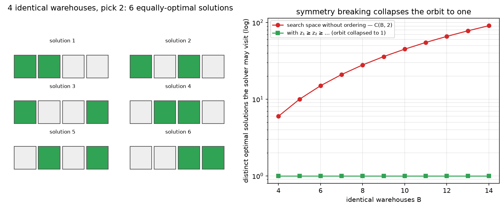

# Phase 1 — Lesson 1.2b: Ordered Selection & Alternative Optima

Two subtle modeling issues that appear constantly in real MILP work.

## 1. "Take the first n items of a queue" — order matters

`Σ yᵢ` is symmetric in the items: it says nothing about *position*. To encode
order you must make position part of the model. Three standard patterns:

### (a) Prefix property (keep the queue order, decide where to cut)
If "take the first n" means *a prefix of the queue* (items 1..n taken,
the rest not), and the solver chooses which/how many:

- cumulative form: `y_i >= y_{i+1}` for all i (once you skip an item,
  you must skip everything after it).
- or count form: `Σ yᵢ = n` (exactly n) plus the prefix chain.

### (b) Position variables (assign items to slots)
If items can be reordered or scheduled into sequence, use the assignment
formulation:

- `x_{i,k} = 1` iff item i occupies slot k.
- each item used once: `Σ_k x_{i,k} ≤ 1`
- each slot filled once: `Σ_i x_{i,k} = 1`
- ordering constraints live *on the slots*: e.g. `start_{k+1} ≥ start_k`,
  or precedence `x_{i,k} ≤ Σ_{k'<k} x_{j,k'}` (j must precede i).

This is the workhorse of scheduling / VRP / sequencing models. Slots carry
the order; items are just assigned to them.

### (c) Rank/cumulative form (selection weight by position)
If "the earlier, the better" can be quantified, you often don't need
binaries for order at all: minimize/maximize `Σ w_i·y_i` where `w_i`
already encodes position (e.g. discount factor `γ^i`). Order enters
through the *objective*, not the constraints.

## 2. Alternative optima & symmetry — "both answers are equally optimal"

`x + y = 1` has two optimal solutions. At toy scale this is a curiosity;
at industrial scale it is a **performance problem**:

- **Symmetry:** if 10 warehouses are interchangeable, every solution has
  10! = 3.6M relabelings. Branch & bound must (in effect) explore the
  same subtree repeatedly → model blows up even though the *substance*
  is one solution.
- **Degeneracy / alternative optima:** many distinct vertices with the
  same objective value; the solver wanders a plateau, and LP relaxations
  give weak guidance.
- **Tolerances:** MILP answers are optimal within `MIP gap` (default often
  1e-4 relative) and feasibility tolerance (~1e-6). Two "optimal" answers
  can differ by tiny amounts; and integrality is enforced only within
  tolerance — a variable reported as 1.0 might be 0.9999999.

### Standard countermeasures

| Problem | Remedy |
|---------|--------|
| Symmetric interchangeable entities | **Symmetry breaking**: force an order, e.g. `y_i ≥ y_{i+1}` (if opened, lower-index opens first), or `cost_1 ≥ cost_2 ≥ ...` |
| Alternative optima slow the search | add a **tiny tie-break term** to the objective: `maximize profit − ε·Σi·yᵢ` (ε ~ 1e-4) — picks the lexicographically nicest optimum among equals |
| Plateau wandering | **warm start** (give the solver a good initial solution), or tighten the formulation (less big-M, better cuts) |
| Tolerance surprises | round binaries explicitly (`y > 0.5`), re-solve with fixed binaries, or tighten `mip_rel_gap` if you need proven optimality |

**Why it's proven:** symmetry-breaking constraints never remove all
representatives of any true solution class (they keep at least one
labeling), so optimality is preserved. The ε tie-break is *not* exact —
it perturbs the problem by at most ε·n, which you accept as modeling
noise (and should state!).

## 3. Miniature demo

`phase1_milp/lesson1_2b_order_symmetry.py` shows all of it on one model:
a queue of items, "take the first n that fit a budget", with and without
the prefix constraint (without it, the solver happily skips item 1 and
takes item 3 — proving `Σ` alone ignores order), plus a symmetry-breaking
pair demonstrating identical interchangeable optima.

*The symmetry half, drawn: B = 4 identical warehouses, choose 2 — all
C(4,2) = 6 selections form one symmetry orbit (same profit, six distinct
solver states). Right: the orbit grows quadratically without an ordering
rule; adding z₁ ≥ z₂ ≥ … collapses it to a single canonical
representative — the free lunch of symmetry breaking. Generated by
`phase1_milp/make_figures_12b.py`.*

## 4. Key takeaways

- Order must be *explicit*: prefix chains, position/slot variables, or
  position-weighted objectives. `Σ` alone is order-blind.
- Equal-cost alternatives are normal; at scale they are a solver-speed
  problem → symmetry breaking + ε tie-break.
- Trust binaries only after rounding; optimality is within a MIP gap.