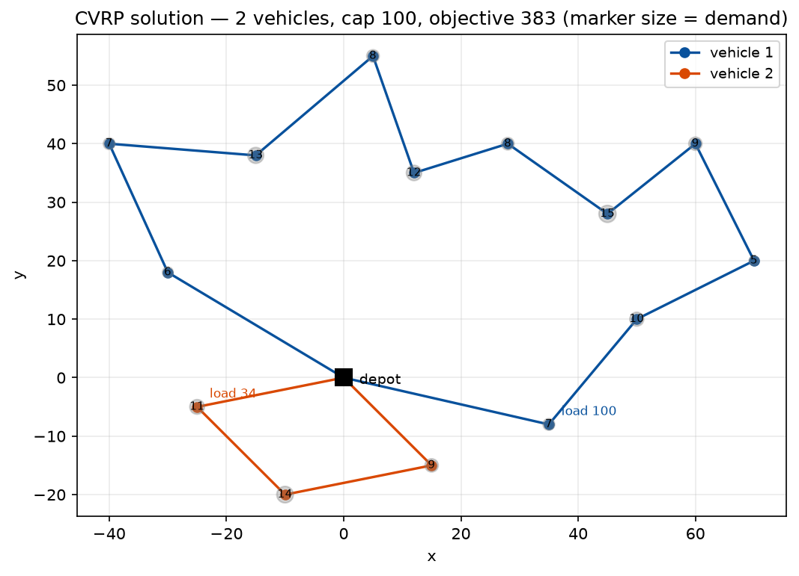

# Phase 1 — Lesson 1.5: The OR-Tools Routing Library (TSP, VRP & friends)

Evidence: `docs/research/phase1_lesson5_routing_evidence.txt` (live run,
ortools 9.15, all outputs quoted there). Demo: `phase1_milp/lesson1_5a_routing_tour.py`,
instance: `data/cvrp_15node.json`.

## The mental model

`pywraplp`/CP-SAT ask you to *declare variables and constraints*. The Routing
library is a different beast: you **declare a search problem over a graph**
(depots, nodes, cost matrix, per-resource dimensions) and it runs a specialized
first-solution + local-search engine built for vehicle routing. You never write
arc-elimination or subtour constraints yourself.

Object chain (always in this order):

```
manager = pywrapcp.RoutingIndexManager(N, K, depot)
routing = pywrapcp.RoutingModel(manager)
transit = routing.RegisterTransitCallback(cb)      # cost/time per arc (must be int!)
routing.SetArcCostEvaluatorOfAllVehicles(transit)  # objective = sum of arc costs
routing.AddDimension(...)                          # one per resource (load, time…)
p = pywrapcp.DefaultRoutingSearchParameters()      # strategy + metaheuristic + limit
sol = routing.SolveWithParameters(p)               # returns None if none found
```

Walk the solution with `routing.NextVar(i)` from `routing.Start(k)` until
`routing.IsEnd(i)`; convert indices with `manager.IndexToNode` (manager indices
≠ node ids — depot/end get special indices).

## Miniature A — TSP in ~20 lines

1 vehicle, arc cost = distance. On our 15-node instance every reasonable
configuration converges to **329** (verified: strategy × metaheuristic table,
all 329) — small instances hide all differences. Route found:
`0→6→5→4→13→12→3→2→1→11→10→14→9→8→7→0`.

## Miniature B — CVRP (capacity)

TSP + demands + vehicle capacity. The pattern: unary callback returning the
node's demand, then a dimension per resource:

```python
dem_idx = routing.RegisterUnaryTransitCallback(demand_cb)
routing.AddDimensionWithVehicleCapacity(dem_idx, 0, [cap]*K, True, "Capacity")
```

`AddDimension...` params that matter: `slack_max` (0 for load; >0 = waiting
time), `capacity`/`vehicle_capacities`, `fix_start_cumul_to_zero` (True for
load — start empty; False for time), name (then `GetDimensionOrDie(name)`).
Verified: K=2, cap=100 on our data → vehicle loads 100+34, objective 383.



*The part-B solution drawn as a map: two vehicles (blue/orange) leaving and
returning to the black depot square; each gray marker is a customer, sized
and numbered by demand; `AddDimensionWithVehicleCapacity` is what forces
the split into a full load (100) and a light one (34). A TSP's single
"optimal tour" would violate both capacities — the dimension is the whole
difference. Generated by `phase2_mdp/make_figures_15.py` re-solving the
same instance with the same parameters.*

## Miniature C — VRPTW (time windows)

Second dimension with slack: transit = service + travel, then per-node windows:

```python
routing.AddDimension(time_idx, slack_max=10, horizon, False, "Time")
time_dim.CumulVar(node).SetRange(lo, hi)
routing.AddVariableMinimizedByFinalizer(time_dim.CumulVar(routing.End(v)))
```

Pitfall we hit live: a horizon of 180 made the model **infeasible** (farthest
round trip > 180) and the solver just returned None — no diagnostic. Rule:
windows must be derived from the metric (we use `[0.8·d0, 1.6·d0+30]`), and
always ask "can the depot→node→depot round trip fit inside [lo, hi]?" before
blaming the search. Verified with horizon 300: objective 391, split 9+5 nodes.

## Miniature D — Pickup & delivery

```python
routing.AddPickupAndDelivery(pickup, delivery)
routing.solver().Add(routing.VehicleVar(p) == routing.VehicleVar(d))   # same vehicle
routing.solver().Add(dim.CumulVar(p) <= dim.CumulVar(d))               # order
```

Verified: all 3 pairs delivered in correct order on one vehicle (objective 347).

## The two search layers

**First-solution strategies** (enum `FirstSolutionStrategy`, ~17 values) build
one initial route set greedily: PATH_CHEAPEST_ARC, PARALLEL_CHEAPEST_INSERTION,
LOCAL_CHEAPEST_INSERTION, BEST_INSERTION, CHRISTOFIDES, GLOBAL_CHEAPEST_ARC,
SWEEP, AUTOMATIC …

**Local-search metaheuristics** (enum `LocalSearchMetaheuristic`, 5 values + UNSET):
GREEDY_DESCENT (converges & stops — fastest), GUIDED_LOCAL_SEARCH (penalizes
over-used arcs; the default recommendation), SIMULATED_ANNEALING, TABU_SEARCH,
GENERIC_TABU_SEARCH.

Strategy **builds**; metaheuristic **improves** within the time limit.
On a random 40-node TSP (seed 7) the same 2 s budget produced 631–697
depending on the pair — see table in the evidence file. Workhorse combo:
`PATH_CHEAPEST_ARC + GUIDED_LOCAL_SEARCH + time_limit`.

## Verified pitfalls (all hit live)

1. **Callbacks must return ints** — round your distances; float costs silently
   break dimension arithmetic.
2. **Infeasible ≠ "search failed"** — a too-small horizon or impossible window
   returns None instantly. Check physical feasibility before tuning search.
3. **SWEEP needs a sweep arranger** — errors out with "Undefined sweep
   arranger for ROUTING_SWEEP strategy" on plain 2-D models in 9.15.
4. **BEST_INSERTION fails fast above ~24 nodes** on plain TSP in 9.15
   (verified: n=20 works 414, n=25+ returns None in 0 s). Use
   PARALLEL_CHEAPEST_INSERTION instead — it is the practical workhorse.
5. **Enum "names"**: `strat.name` does not exist on the Python enum wrappers —
   build your own int→name dict (see `NAMES` in the demo).
6. **Late-binding lambda trap**: a `lambda a, b: M[a][b]` inside a loop keeps
   referencing the *current* `M` — we silently solved the 40-node model on the
   15-node matrix (objective 0) until we rebound it.
7. **Objective is global, not per-vehicle** — `sol.ObjectiveValue()` already
   sums all vehicles; don't add it up in the vehicle loop (we did, 766 ≠ 383).

## When Routing vs CP-SAT vs MIP?

- Rich side constraints (driver rules, heterogeneous fleet, complex costs) or
  need for proven optimality → model it in CP-SAT/MILP (`AddCircuit` for TSP).
- Large VRP instances, soft/optional visits, "give me something good in 5 s" →
  Routing library with GLS.
- Both scale: Routing handles thousands of nodes with metaheuristics; CP-SAT
  proves optimality but explodes combinatorially on routing structure.

## Exercises

1. Add a third vehicle to the CVRP demo; does objective improve? Explain via
   fixed vehicle costs (try `routing.SetFixedCostOfVehicle`).
2. Make 3 nodes optional with `AddDisjunction([node], penalty)`; find the
   penalty threshold at which each node stops being served.
3. Break P&D intentionally (drop the CumulVar order constraint) and show the
   library then allows delivery-before-pickup.
4. Run the 40-node TSP with GLS at 2 s vs 30 s; plot convergence.
5. After lesson 1.7: rebuild the CVRP's GLS loop by hand (destroy & repair
   fragments with CP-SAT) and race it against the library enum on the same
   instance — see exactly what the production engine adds (parallel
   operators, adaptive weights, sideways moves).
