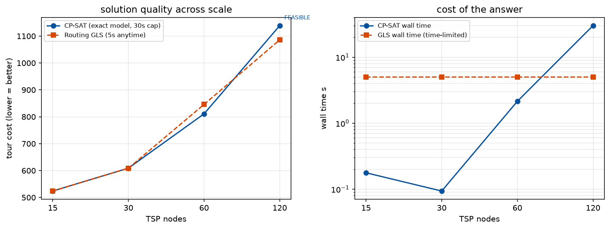

# Phase 1 — Lesson 1.7: Large Neighborhood Search & the "too big for exact" decision

Evidence: `docs/research/phase1_lesson7_lns_scale_evidence.txt` (live run,
ortools 9.15). Demos: `phase1_milp/lesson1_7a_lns.py`,
`phase1_milp/lesson1_7b_scale_cpsat_vs_routing.py`.

## 1. LNS — the idea that ate the optimization world

Large Neighborhood Search = **destroy** a fragment of the current solution,
**repair** it optimally (or near-optimally), repeat. It is the bridge between
exact and heuristic:

- Exact solver on the full problem: too slow.
- Hand-rolled local search: fast but weak neighborhoods.
- LNS: the neighborhood IS an exact sub-problem — each iteration makes an
  *optimal* local move.

`lesson1_7a` implements it in ~40 lines on the 15-node TSP:
destroy = remove a random 6-node fragment; repair = re-order the fragment
optimally with CP-SAT `AddCircuit` (2 s cap per fragment, usually milliseconds).
Live result: NN start 430 → 407 in 5 s (~630 iterations). Reference: the
production Routing engine reached 329 — its internal LNS destroys/repairs
*many* fragments in parallel and accepts sideways moves, which our toy
single-fragment, better-only version doesn't. Same idea, 60 years of
engineering.

## 2. Where exact stops winning (measured)

`lesson1_7b` solves the same TSP family with CP-SAT (AddCircuit, 30 s cap)
and Routing GLS (5 s cap) at growing n:

| n | CP-SAT | Routing GLS 5 s |
|---|---|---|
| 15 | 524 OPTIMAL in 0.1 s | 524 (in 5 s) |
| 30 | 609 OPTIMAL in 0.1 s | 609 |
| 60 | 811 OPTIMAL in 1.9 s | 846 — CP-SAT better! |
| 120 | 1111 FEASIBLE after 30 s, gap 1064 | 1086 — GLS better |

Reading:
- To n≈60, **model it in CP-SAT**: you get optimality *and* a certificate,
  and it is actually faster to a good answer.
- At n≈120 the exact search collapses (bound 1064 vs incumbent 1111 = huge
  gap) while GLS quietly returns 1086 — better than the exact incumbent.
- Crossover is problem-dependent, but 50–100 nodes for TSP-like structure is
  the honest ballpark on a real machine.



*The scale experiment re-plotted (same seeds — note n=120's CP-SAT run
lands on a slightly different FEASIBLE incumbent each run; the qualitative
story is invariant). Left: quality — CP-SAT wins up to n=60, then the
FEASIBLE annotation marks where optimality is lost and GLS pulls ahead at
n=120. Right: what the answer costs — CP-SAT's wall time jumps 15× from
n=60 to n=120 while GLS burns exactly its 5 s budget every time. Generated
by `phase2_mdp/make_figures_17.py`.*

## 3. The decision guide (what to reach for)

```
1. Is the problem small/structured?            → CP-SAT / MILP, exact, done.
2. VRP-shaped with side constraints?           → Routing library + GLS + time limit.
3. Huge, exotic objective, no clean model?     → custom metaheuristic (lesson 1.6)
                                                 or LNS with an exact repairer (this lesson).
4. Need a guarantee for the client?            → exact on a restricted model
                                                 (aggregation) + heuristic on the full one.
```

Production-grade pipelines often do 3+4: heuristic solution + LP/MILP
relaxation bound = *rigorous* optimality gap without solving exactly
(demonstrated on knapsack in lesson 1.6b).

## 4. CP-SAT knobs for anytime behavior (the honest summary)

CP-SAT has no "metaheuristic" flag because it doesn't need one: with
`max_time_in_seconds` + `num_workers` it runs dozens of internal LNS workers
in parallel and returns `FEASIBLE` (with `best_objective_bound` = the rigorous
lower/upper bound) when time runs out. Check `solver.best_objective_bound` and
`response_stats` — an anytime CP-SAT answer *with its gap* usually beats a
metaheuristic without a bound.

## Pitfalls (verified)

1. LNS repair must be *fast* — an exact repairer with a 2 s cap still wasted
   30% of iterations on hard fragments; cap sub-solves at milliseconds.
2. `AddCircuit` needs a *single* Hamiltonian circuit over the fragment nodes;
   remember the fragment is open (reinserted between fixed neighbors), so do
   NOT include the depot in the sub-model.
3. In the scale test, CP-SAT at n=120 reported FEASIBLE with a *bound* far
   below the incumbent — that's not failure, that's information: read
   `best_objective_bound` before declaring a winner.
4. Routing GLS always burns its full time limit (anytime ≠ early exit); if you
   need a quick answer, lower `time_limit`, don't expect it to stop early.

## Exercises

1. Accept equal-length moves in lesson 1.7a (plateau walks); measure the
   improvement at 5 s.
2. Destroy *two* fragments per iteration; compare iterations-to-329.
3. Add `solver.parameters.relative_gap_limit` to the fragment repairer; what
   repair quality keeps the outer loop converging?
4. Run lesson 1.7b at n=90 with CP-SAT 10 min (background) and find the true
   crossover on this machine.
