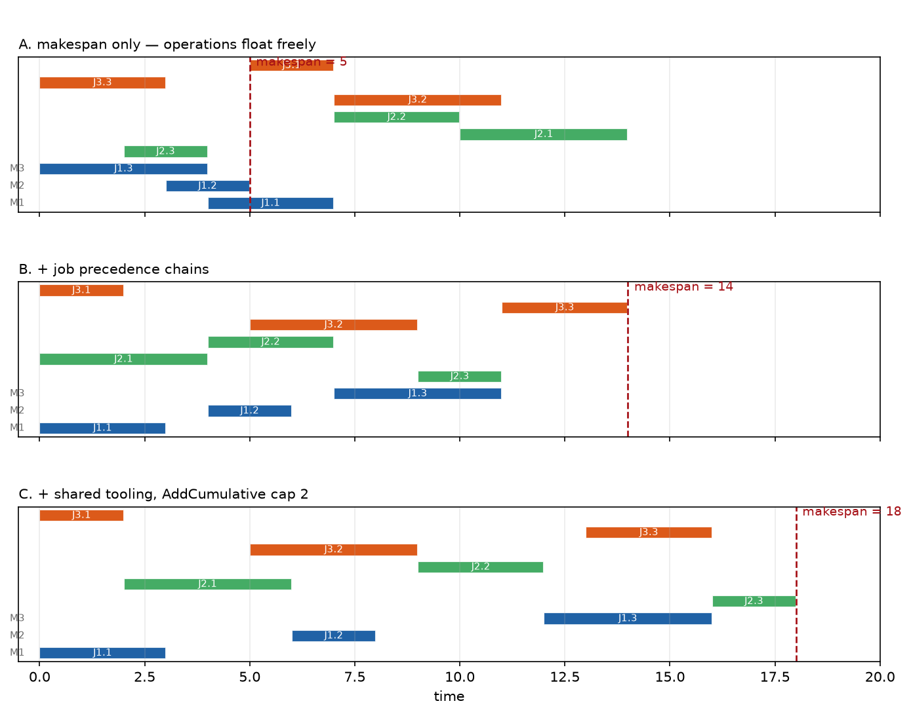

# Phase 1 — Lesson 1.8: Scheduling, Flows & Bin Packing — the rest of the OR-Tools toolbox

Evidence: `docs/research/phase1_lesson8_toolbox_evidence.txt` (live run,
ortools 9.15). Demos: `phase1_milp/lesson1_8a_scheduling.py`,
`lesson1_8b_flows.py`, `lesson1_8c_binpacking.py`.

## 1. CP-SAT scheduling: interval variables are the whole idea

Scheduling in CP-SAT is not "model time with integer variables" — it has
first-class **interval objects**:

```python
s, e = model.NewIntVar(0, H, "s"), model.NewIntVar(0, H, "e")
iv = model.NewIntervalVar(s, dur, e, "op")     # ties start+dur=end
model.AddNoOverlap([iv1, iv2, ...])            # unary resource (machine)
model.AddCumulative([iv...], [demand...], cap) # renewable resource
iv_opt = model.NewOptionalIntervalVar(s, d, e, present_lit, "op")  # optional
```

Measured on a 4-job × 3-machine job-shop (live):



*The ladder as Gantt charts (one panel per variant): without precedence
the operations float and pile at 5; chaining jobs stretches the makespan
to 14; the shared tooling cap (AddCumulative) pushes it to 18. Each added
constraint buys structure at a measurable price — the dashed lines mark
the makespan per panel. Generated by `phase1_milp/make_figures_18.py`
(re-solves the same model live).*

- makespan only: **5** (operations float freely — nothing chains them)
- + precedence within jobs: **14**
- + shared tooling `AddCumulative(cap=2)`: **18**

The ladder shows each constraint's cost in objective terms — pedagogically
better than one big model.

Verified pitfalls:
1. `model.Minimize(max(ends.values()))` **crashes** (`NotImplementedError:
   Evaluating a BoundedLinearExpression ... as a Boolean is not supported`) —
   Python's `max` over model expressions is not a model expression. Declare a
   `makespan` IntVar, add `makespan >= end_of_last_op(job)` per job, minimize
   that.
2. `NewOptionalIntervalVar` takes the *presence literal* as 4th positional
   arg — use it for machine assignment (flexible job shop): one optional
   interval per (op, machine) pair, `AddExactlyOne` over the literals.
3. `AddNoOverlap` is per-resource: build one list per machine, not one global.
4. Time symmetry: bound start vars to `[0, horizon - dur]`; without an
   explicit horizon CP-SAT still solves but propagation is weaker.

## 2. Dedicated graph solvers: when a flow IS your problem

`ortools.graph.python` ships specialized solvers that beat generic MILP by
orders of magnitude on pure network problems:

| Solver | Pattern | Our result |
|---|---|---|
| `min_cost_flow.SimpleMinCostFlow` | supply/demand nodes, per-arc cost | transport 3→4, cost **500** OPTIMAL, 0.16 s total script |
| `max_flow.SimpleMaxFlow` | capacities only | 0→5 = **18** |
| assignment trick | workers/tasks as supply ±1 | 5×5 cost **16** |

API shape: `add_arc_with_capacity_and_unit_cost(tail, head, cap, cost)`,
`set_node_supply(node, ±amount)`, `solve()`, then read `flow(arc)` per arc.
Negative supply = demand. Assignment = bipartite min-cost flow with unit
capacities — no MIP needed at all.

Verified pitfalls:
1. Status enums differ per solver class: min-cost flow has
   `OPTIMAL/FEASIBLE/INFEASIBLE/UNBALANCED/NOT_SOLVED`; **max flow only has
   `OPTIMAL/BAD_INPUT/POSSIBLE_OVERFLOW`** — a shared `StatusName` helper
   crashes across classes. Map them per class (see demo).
2. Node supplies must sum to zero for a standard circulation; the transport
   pattern uses a super-source (+total supply) and super-sink (−total demand).
3. `solve(source, target)` (max flow) vs `solve()` (min cost flow) — different
   signatures, easy to mix up.

## 3. Bin packing: heuristics meet exact, with a bound

24 items, capacity 120 (live):
- L2 lower bound (total size / capacity, ceil): **10**
- Next Fit: 14 · First Fit: 12 · **First Fit Decreasing: 10**
- CP-SAT exact (bin booleans + `AddMaxEquality` used-links + symmetry
  breaking `used[b] <= used[b-1]`): **10 OPTIMAL**

Lessons: FFD matched the optimum here (classic worst-case guarantee: FFD ≤
11/9·OPT + 6/9), and the exact model only needed `max_bins = FF result` —
heuristics give the exact solver its search space. The symmetry-breaking
link (`used[b] ≤ used[b−1]`) is what makes CP-SAT not enumerate bin
permutations.

## 4. Updated decision guide (supersedes lesson 1.7)

```
Pure flow / transport / assignment  → ortools.graph dedicated solvers (instant)
Scheduling (intervals, resources)   → CP-SAT interval vars + NoOverlap/Cumulative
Bin packing / cutting stock         → FFD warm start + CP-SAT exact for the last bins
VRP-shaped                          → Routing library (lesson 1.5)
General MILP                        → pywraplp / scipy.milp (lessons 1.1-1.3)
Too big for any exact               → metaheuristics / LNS (lessons 1.6-1.7)
```

## Exercises

1. Convert 1.8a to flexible job shop with `NewOptionalIntervalVar`: each op
   may run on 2 machines with different durations. Does the makespan drop
   below 18?
2. Add tear-down/setup times via `AddCircuit` over the ops of one machine.
3. Scale the assignment problem to 50×50 and compare min-cost flow vs
   scipy.optimize.linear_sum_assignment wall time.
4. Cutting stock: replace bin capacity with pattern-count columns and compare
   against FFD on 100 items (Gilmore–Gomory hint).
