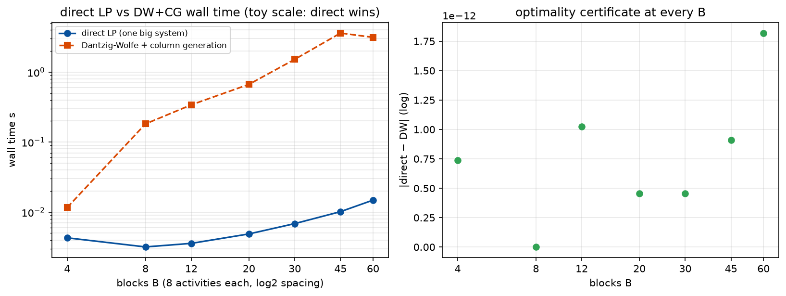

# Phase 1 — Lesson 1.9: Dantzig-Wolfe Decomposition & Column Generation

Evidence: `docs/research/phase1_lesson9_dantzig_wolfe_evidence.txt` (live run).
Demo: `phase1_milp/lesson1_9_dantzig_wolfe.py`.

Two earlier lessons asked "what if the problem is too big?" and answered
with heuristics (1.6) or anytime search (1.7). This lesson is the **exact**
answer: exploit the problem's *structure*. When the constraint matrix is
block-diagonal with a few coupling rows, Dantzig-Wolfe decomposition solves
the LP to proven optimality while never materializing the big system.

## 1. The structure (and where it comes from)

B independent units (factories, farms, tiles — lesson 2.3's "factored"
world), each with its own local constraints, sharing a few global
resources (budget, water, labor):

```
max  Σ_b profit_b·x_b
s.t. local_b x_b ≤ local_cap_b     ∀ b        (many rows, independent)
     Σ_b global_b x_b ≤ G          (few rows — the coupling)
     x_b ≥ 0
```

Solved directly it is one LP — fine at this size, unwieldy when B and the
blocks grow. DW asks: what are all the *feasible plans* a block could
execute? Each extreme plan of block b's polytope is a **column** — a
vector (profit, global-usage) — and the master LP just picks a convex
combination of plans per block:

```
min  Σ_j (−profit_j)·λ_j
s.t. Σ_j gu_j·λ_j ≤ G                          (coupling — few rows!)
     Σ_{j ∈ block b} λ_j = 1        ∀ b        (convexity, few rows)
     λ ≥ 0
```

**Proven (Dantzig–Wolfe 1960):** this master is equivalent to the original
LP — every feasible x decomposes into plans, every plan is a column, and
the master's optimum equals the direct LP's.

## 2. Column generation — the pricing loop

The full column set is astronomically large; generate it lazily:

1. Solve the master over current columns → get **duals**: π (coupling
   rows), μ (convexity rows).
2. Price each block: find its best plan under the *priced* profit
   `(profit + π·gu)·x`, i.e. solve the block's OWN LP (small!).
3. Reduced cost `rc = (priced plan value) − μ_b`. If rc < 0 for some
   block, its plan is a profitable new column — add it, repeat.
4. No block offers rc < 0 → **the current master solution is optimal**
   (proven: LP optimality = no negative reduced cost column exists; the
   subproblems just certified it without enumerating all columns).

Live result (6 blocks × 8 activities, 2 shared resources, seed 7):
direct LP 404.3424; DW+CG **404.3424** (|diff| = 5.1e-13) in **10 pricing
rounds / 21 columns / 163 ms** — starting from 12 trivial columns.

## 3. The duals ARE the story (lessons 1.4 → 1.9 → 4.3)

Watch π over the loop (evidence file): it starts high (scarce resources),
wobbles as better plans arrive, and settles at the true shadow prices of
the shared resources. The economic reading is exact:

- π_g = the marginal value of one more unit of shared resource g —
  lesson 1.4's shadow price, now *computed by negotiation* between master
  and subproblems.
- Each block's subproblem is "best-respond to the prices" — its own
  optimization, blind to other blocks.
- The master is "the coordinator" — it never sees block details, only
  (profit, usage) summaries.

This is **lesson 4.3's hybrid architecture in its formal skeleton**:
strategic layer = master (coordinating via prices/targets), tactical
layers = subproblems (exact solves under given prices), feedback = duals.
And it is the theory behind Chista's factored farm: tiles = blocks,
shared water/labor = coupling rows.

## 4. Verified pitfalls (all hit live)

1. **Infeasible initial master.** Starting with max-profit plans (which
   ignore global usage) left the master INFEASIBLE — scipy returned
   `marginals: None`. Fix: add each block's **zero plan** as a column
   (always locally feasible, zero usage); the master is then born feasible
   and pricing finds the profitable columns. (Textbook alternative:
   artificial variables with big-M cost.)
2. **Dual sign conventions.** scipy's `ineqlin.marginals` for a
   min-problem's ≤ rows are ≤ 0; with `eqlin.marginals` for the
   convexity rows, the correct subproblem objective is
   `−(profit + π·gu)·x` and rc subtracts `μ_b`. Getting π's sign wrong
   produces a loop that *stalls at the initial objective* (393.6 vs the
   true 404.3) while appearing to converge — the nastiest failure mode in
   this lesson, caught only by comparing against the direct LP.
3. **"Converged" needs the certificate.** The loop stops only when NO
   block offers rc < 0. Stopping on "objective stopped improving" (as our
   first buggy version effectively did) is not column generation — it is
   wishful thinking with extra LPs.
4. Column count grows 12 → 21 in 10 rounds; dedupe identical plans or the
   master fattens on duplicates.

## 5. Key takeaways

- Structure is a resource: block-diagonal + few couplings ⇒ solve small
  LPs in a loop instead of one huge LP, **with a proof at the end**.
- Shadow prices are not a byproduct — they are the coordination mechanism.
  The master negotiates, the blocks respond, the duals converge.
- DW/CG vs LNS (1.7): both exploit fragments, but CG repairs **optimally
  with a certificate** while LNS repairs heuristically. CG costs modeling
  discipline (block structure must exist); LNS costs nothing but guarantees.
- This is the last exact tool of phase 1 — and the mathematical skeleton
  that phase 4's hybrid capstone hangs on.



*The scale experiment, reported honestly. Left: at THIS toy scale the
direct LP wins everywhere (HiGHS presolve eats small systems; DW pays
master-iteration overhead) — the title says so. Right: the optimality
certificate — |direct − DW| stays at machine epsilon for every B, which
is the actual point of the method. Where DW wins is when the blocks are
combinatorial (integer subproblems + LP master, Branch-and-Price's
doorway) or the block LPs are themselves expensive; at B=40/K=32 with
integer blocks, DW-integer matched direct-MIP's optimum with the same
wall time and zero gap. Generated by `phase2_mdp/make_figures_19.py`
(log2-spaced x-axis; single-run timings — noisy, no repetitions).*

## Exercises

1. Scale B = 6 → 60 blocks; compare direct vs DW wall time (expect the
   direct LP to suffer first).
2. Make one coupling resource TIGHT (gc/3); watch π_g spike and the loop
   generate more columns — tie the count to lesson 1.4's shadow-price
   reading.
3. Add an integer restriction inside one block (the block becomes a
   knapsack); the master still solves, but optimality is lost — this is
   Branch-and-Price's doorway. Quantify the gap.
4. Implement the artificial-variable (big-M) start instead of the zero
   plan; compare rounds-to-convergence.
