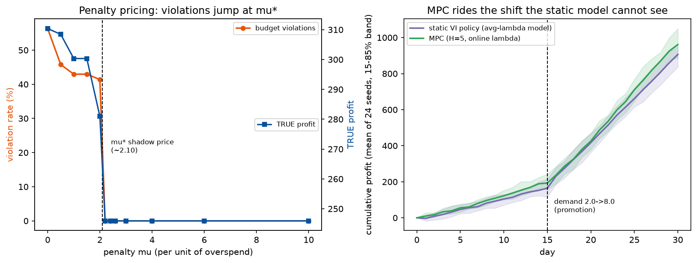

# Phase 2 — Lesson 2.10: Design Tradeoffs III — Constraints & Deployment

The last design lesson: two dials about *how the model meets reality*
— how a rule the business cares about enters the optimization (hard
constraint vs priced penalty) and how the policy runs after training
(precomputed table vs re-planning MPC). 2.8 measured resolution, 2.9
measured objective design; this one closes the trilogy with the
constraints that survive contact with operations.

Evidence: `docs/research/phase2_lesson10a_constraint_penalty_evidence.txt`
and `...10b_precompute_mpc_evidence.txt` (live runs).
Demos: `phase2_mdp/lesson2_10a_constraint_penalty.py`,
`phase2_mdp/lesson2_10b_precompute_mpc.py`.

## 1. Constraint vs penalty — and the shadow price you can read

Same inventory MDP with a per-order spend cap (COST·a ≤ 6, i.e. ≤ 2
units). Three formulations, all scored in the TRUE reward over 20k
rollouts:

*Left: the penalty sweep — violations hold ~41–56% until μ crosses the
shadow price (~2.1), then snap to zero while TRUE profit falls to the
hard-cap level; the jump IS the discrete-action CMDP dual. Right: the
deployment race over 16 seeds (mean, 15–85% band) — MPC pulls away
after the day-15 promotion the static model cannot see.*

| formulation | profit | violations | avg spend |
|---|---|---|---|
| hard-constrained (actions removed) | 246.06 | 0% | 5.95 |
| penalty μ=1 | 300.52 | **43%** | 8.00 |
| penalty μ=2 | 281.14 | **41%** | 7.20 |
| penalty μ=5 / μ=30 | 246.06 | 0% | 5.95 |
| CMDP dual μ\* (≈2.03) | 246.06 | 0% | 5.95 |

Reads: a small μ **under-deters** — the fine is cheaper than the profit
the violating orders unlock, so the policy breaks the budget 40%+ of
the time while *looking* better in its own (penalized) units. Large μ
**over-deters** (here the collapse coincides with the hard cap because
the discrete jump is sharp; with richer action spaces an over-priced μ
buys strictly less spend than the cap allows). The **μ\*** at which
violations stop is the constraint's *shadow price* — the occupancy-LP
dual of lesson 2.7, found here by bisection. Two honest notes: with
discrete actions the violation rate **jumps** at the critical μ, so μ\*
lands in a bracket, not a point (bisection + grid scan reported both);
and an LP-solver attempt at the dual hit a scipy marginals quirk, so
the bisection route is the one in the evidence.

μ\* is a readable business number — "one more unit of budget per order
is worth ~μ\* per episode" — the same dual price that lesson 1.4 reads
off MILPs and lesson 4.6 puts on risk.

Rule of thumb: hard-constrain what is *legally* binding; penalize what
is *economic* — and report μ\* so the business can buy or sell budget
knowingly.

## 2. Precomputed policy vs receding-horizon MPC

Same inventory problem; demand **shifts 2.0 → 8.0 at day 15** (a
promotion the static model was never told about). Two deployment
styles, **16 paired seeds**:

| deployment | profit (mean) | compute |
|---|---|---|
| static VI (trained on average λ) | 363.98 | ~0 ms/decision |
| MPC (H=5, online demand estimate) | **389.74** | 8.5 ms/decision |

MPC gains **+7.1%** not by being smarter *per decision* but by
re-solving the same tiny MDP with fresh statistics — it rides the shift
the static policy cannot even represent. Its two honest costs: **solve
time per decision** (trivial here; the whole subject of lesson 1.7 at
CP-SAT/GLS scale) and **myopia** — a 5-step horizon silently becomes
greedy when lead times exceed H.

**Methodological correction (kept in the evidence):** the first version
of this demo used a mild shift (2→4), a slow estimator (EMA 0.3), and a
single seed — and reported +4.6% for MPC that vanished under multi-seed
diagnosis (MPC actually *lost* by ~3 points). The corrected setup above
is the reproducible result. Two design facts surfaced: **estimator
speed** and **shift magnitude** are part of the deployment decision
itself, not noise around it.

Rule of thumb: precompute when the world is stationary and decisions
are frequent; re-plan when the world moves or the model was wrong —
and budget the solver honestly (the 2.8 time-granularity lesson
applies to the replanning loop too).

## 3. The trilogy in one line

2.8: *how finely you see* (time/state resolution) · 2.9: *what you ask
for* (reward, terminal value) · 2.10: *what rules bind and how it
runs* (constraint pricing, re-planning). Every dial is invisible in
the algorithm's own report — each demands an independent truth:
lifted rollouts (2.8), true-reward scoring (2.9), violation rates and
shifted worlds (2.10).

## 4. Bridge

- Upstream: 2.7's occupancy LP is the formal CMDP behind μ\*; 1.4's
  duals are the same price in MILP clothing; 1.7 previews the compute
  cost of re-planning at scale.
- Downstream: 4.3's hybrid architecture is exactly these choices made
  deliberately (MILP tactical layer = hard constraints + μ\* prices;
  MDP strategic layer = precomputed, re-solved at day boundaries).
