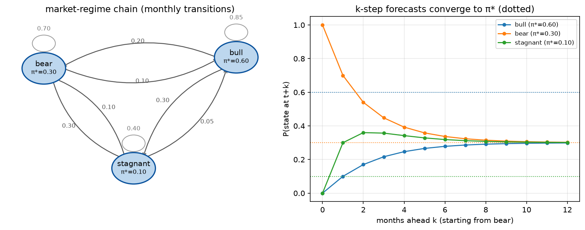

# Phase 2 — Lesson 2.1: Markov Chains — Memoryless Uncertainty

## 1. Why we need this phase

Phase 1 solved *deterministic* problems: every number was known. But
portfolios, inventories, farms, and markets are **random**. The Markov
chain is the simplest mathematical object that captures "the future depends
on where I am now, not on how I got here" — the **Markov property**.

## 2. The definition



*Left: the chain as a graph — each arrow is a transition probability
(self-loops = staying), and each node carries its stationary share π\*.
Right: k-step forecasts `π_0·P^k` starting from bear — every curve lands on
its dotted π\* line: the "ergodic theorem" of §4, seen rather than stated.
Generated by `phase2_mdp/make_figures_21.py` (same matrix, seed, and
100k-month simulation as `lesson2_1_markov_chain.py`).*

A **Markov chain** = a finite set of states `S` + a **transition matrix** `P`
where `P[i, j]` = probability of moving from state i to state j *tomorrow*,
given we're in state i *today*.

Two mathematical requirements (both proven to be necessary and sufficient
for `P` to be a valid stochastic matrix):
- every row sums to 1: `Σⱼ P[i,j] = 1`
- every entry ≥ 0

**The key calculation:** if today's state distribution is a row vector
`π_t` (probabilities of being in each state), then tomorrow's is:

```
π_{t+1} = π_t · P          (one step)
π_{t+k} = π_0 · P^k        (k steps: just matrix power!)
```

This one line is why Markov chains are computationally beloved: forecasting
uncertainty is linear algebra, not simulation.

## 3. The miniature problem — market regime (bull/bear/stagnant)

A market lives in 3 states with monthly transitions (illustrative numbers):

| from \ to | bull | bear | stagnant |
|-----------|------|------|----------|
| bull      | 0.85 | 0.10 | 0.05 |
| bear      | 0.20 | 0.70 | 0.10 |
| stagnant  | 0.30 | 0.30 | 0.40 |

Questions a portfolio manager actually asks — and this model answers:
1. If we're in a bear market now, what's the chance of a bull in 3 months?
   → `π_0 = [0,1,0]; π_0 · P³`
2. In the long run, what fraction of months are bear months? → the
   **stationary distribution** `π*` with `π* = π*·P`
3. How fast is memory of today forgotten? → eigenvalues of P.

## 4. Stationary distribution — the long-run law

`π*` satisfies `π* P = π*` — i.e. **π\* is a left eigenvector of P with
eigenvalue 1** (normalized to sum 1). Existence/uniqueness is *proven*:
if the chain is **irreducible** (every state reachable from every state)
and **aperiodic**, a unique π\* exists and `π_0 P^k → π*` from ANY start
(the "ergodic theorem for Markov chains" — proven, no proof shown here).

Practical computation: `π* = null-space of (Pᵗ − I)` or the eigenvector of
`Pᵗ` for eigenvalue 1.

## 5. Run it

```bash
uv run python phase2_mdp/lesson2_1_markov_chain.py
```

The script: builds P, (a) simulates 100,000 months by sampling and
empirically recovers P, (b) answers the 3 questions via linear algebra,
(c) verifies simulation converges to the analytic π\*.

## 6. Key takeaways

- Markov property = "memoryless": all history compresses into the current
  state. **State design is therefore THE modeling act** — if the future
  really depends on more than the current state, your states are too
  coarse (the fix: enlarge the state, e.g. (regime, cash, inventory)).
- `P^k` = k-step forecast; `π*` = long-run forecast. Both are exact.
- **Proven results you may rely on:** existence/uniqueness of the
  stationary distribution under irreducibility+aperiodicity; convergence
  `π_0 P^k → π*`; and the Perron-Frobenius theorem backing eigenvalue 1.
- Everything here is NumPy-only. No solver, no library magic — this is the
  foundation the MDP (lesson 2.2+) adds *actions* to.
