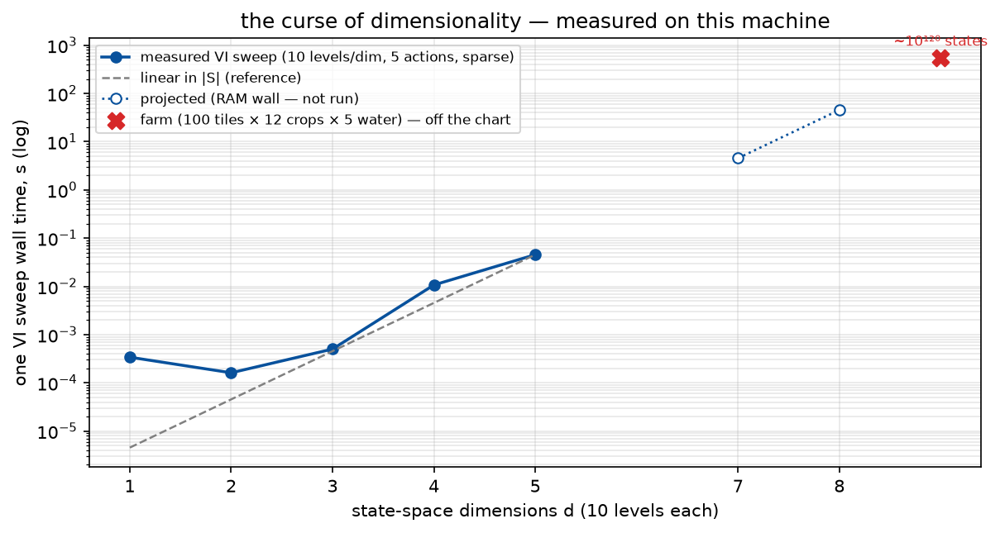

# Phase 2 — Lesson 2.4: Beyond Tabular — Approximation, the Curse, and the LP View

Lesson 2.3 classified MDPs; this lesson shows *what breaks* when the
taxonomy leaves the toy regime, and the exact mathematics that survives.

## 1. The curse of dimensionality — concrete numbers



*The lesson-1 table, turned into a measurement (this machine, sparse
transitions with 8 nonzeros per (s,a) row, 5 actions): one VI sweep from
d = 1..5 state dimensions (10 levels each), with the d = 7–8 points
dashed (projected — the RAM wall stops the 3-GB VM from running them) and
the farm catastrophe (100 tiles × 12 crops × 5 water ≈ 10¹²⁰ states) off
the chart entirely. Generated by `phase2_mdp/make_figures_24.py`.*

Tabular VI/PI cost O(|S|²·|A|) per sweep (the einsum in lesson 2.2).
With state = (cash levels) × (inventory levels) × (regimes):

| dimensions | |S| if 10 levels each | VI sweep time (numpy, ~10⁷ flops/s est.) |
|------------|----------------------|------------------------------------------|
| 1 (lesson 2.2) | 11 | < 1 ms |
| 2 | 121 | ~ms |
| 3 | 1,331 | ~10 ms |
| 5 | 10⁵ | ~1 s |
| 8 | 10⁸ | ~2 min per sweep × hundreds of sweeps |
| farm (100 tiles × 12 crop states × 5 water levels) | 10¹²⁰ | hopeless |

**Bellman's curse is exponential in the number of state dimensions.** Every
practical method below is a way to refuse to enumerate S.

## 2. Escape route 1 — Linear Function Approximation (LFA)

Replace `V(s)` (a table) with `V_θ(s) = θᵀ φ(s)` — φ(s) a feature vector
(e.g. [cash, inventory, cash·regime, ...]), θ a few weights. The Bellman
backup becomes a *least-squares projection* instead of a table write:

- **LSTD / LSPI**: solve for θ directly with linear algebra. Convergence
  of LSTD is guaranteed for the *evaluation* problem (proven); LSPI
  (control) works well in practice but has weaker theory.
- Error view: you get the best value function *inside the span of φ*.
  Feature engineering = deciding what V can even express.

This is the exact ancestor of neural RL (phase 3): same projection idea,
φ(s) replaced by a learned network.

## 3. Escape route 2 — the LP formulation of MDP (the phase-1 bridge)

The whole MDP can be written as a LINEAR PROGRAM (proven equivalence,
de Farias & Van Roy's linear-programming approach):

```
minimize   Σ_s α(s) V(s)                    (α any positive distribution)
subject to V(s) ≥ R(s,a) + γ Σ_{s'} P(s'|s,a) V(s')    ∀ s, a
```

The constraints ARE the Bellman inequalities — the max hides inside
"≥ for all a". Why this matters to you:

1. **It unifies the course:** MDP solving = LP solving. The VI fixed point
   is the LP optimum.
2. **Approximation slots in**: restrict `V(s) = θᵀφ(s)` inside the LP →
   an *approximate linear program* (ALP) — still an LP, solvable by
   phase-1 tools on problems where tabular dies. Error bounds are
   *provable* under mild conditions (norm bound on V* relative to φ-span).
3. **Constrained MDPs** become clean LPs too: the occupancy-measure
   formulation turns "maximize reward subject to max-drawdown ≤ X" into
   linear constraints over state-action frequencies — risk constraints in
   trading policies solved with exactly the phase-1 toolbox.
4. **Dual meaning:** LP duality gives the occupancy measure
   (long-run state-action distribution) as the dual variable — the same
   shadow-price intuition from lesson 1.4, now pricing *states*.

## 4. Escape route 3 — rollout / receding horizon (MPC)

When even the LP is too big: don't solve the whole future. At each real
step, solve ONLY the next H steps (a small finite-horizon problem, exactly
as in lesson 2.2's backward induction), execute one action, observe, repeat
(Model Predictive Control). Proven property: with a good terminal-value
estimate V̂(s_{t+H}) appended, MPC is near-optimal if V̂ is good; even with
V̂=0 it beats greedy one-step behavior. This is how the Kaggriculture agent
thinks about one day at a time.

## 5. A concrete mini-experiment (script)

`phase2_mdp/lesson2_4_approx.py`:
(a) takes the lesson-2.2 inventory MDP, doubles the state space with a
market-regime dimension (bull/bear modifies demand) → tabular still fine,
showing the boundary;
(b) solves the SAME problem as an ALP with RBF features in only 6
variables instead of 22 — reports the value-function error against exact
tabular V;
(c) demonstrates the occupancy-dual: solves the LP directly with
highspy/scipy and compares the optimal policy to PI's.

## 6. Key takeaways

- Tabular exact methods are a *tiny island*: |S| beyond ~10⁵ makes them
  impractical. Everything past that is approximation + optimization.
- The MDP-as-LP view (proven) means phase-1 skills solve phase-2 problems:
  Bellman inequalities = LP constraints; duality = state pricing;
  constraints = CMDP risk control.
- LFA/ALP trade exactness for scale with provable error bounds — the
  honest, mathematically grounded middle ground before neural RL.
- MPC/rollout is the practitioner's default for big episodic problems.
