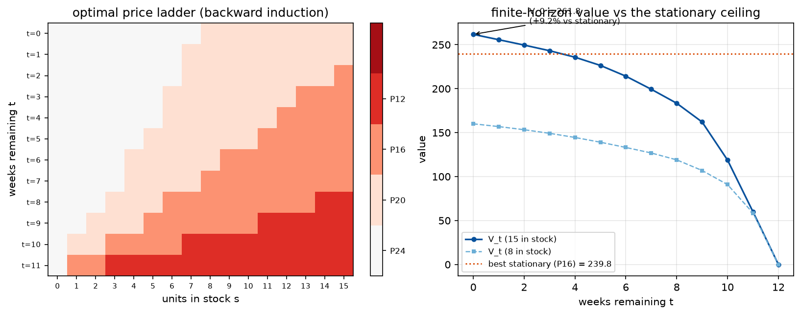

# Phase 2 — Lesson 2.6: Finite Horizon — Backward Induction & the Value of Time-Dependence

Evidence: `docs/research/phase2_lesson6_finite_horizon_evidence.txt` (live run).
Demo: `phase2_mdp/lesson2_6_finite_horizon.py`.

Lesson 2.3's Axis 3 listed four horizon formulations; only the discounted
infinite one has run so far. This lesson runs the **finite-horizon** machine:
value becomes a function of *time*, and the policy follows.

## 1. Backward induction — the finite-horizon Bellman

With a known end T, define V_t(s) recursively from the boundary:

```
V_T(s)  = 0                        (perishable: unsold stock is worthless)
V_t(s)  = max_a [ r(s,a) + E_{s'} V_{t+1}(s') ]     t = T-1 … 0
```

Same contraction-free logic as 2.2 but with **no discounting needed** — the
finite end replaces γ as the convergence device (proven: finite horizon has
a unique value function; no fixed-point theorem required).

## 2. The miniature — seasonal markdown (fashion item, 12 weeks)

State (t, s) = (weeks left, units on hand), stock ≤ 15. Action = price from
{24, 20, 16, 12}; demand ~ Poisson(λ(price)) with λ = [0.4, 0.9, 2.2, 5.0]
(elasticity). Unsold units vanish at T.

Live results (12×16 grid):
- The optimal **price ladder** falls as both t→T and s↑: high price when
  time is plenty, P16→P12 fire-sales in the last weeks with heavy stock.
  Rows of the policy table literally encode "markdown schedule" — the thing
  retail managers hand-tune, derived exactly.
- V_0(s=15) = **261.78**.

## 3. The headline experiment: time-dependence is worth 9.2%

Force ONE price for all 12 weeks (best stationary choice): always-P16
yields **239.81**. Optimal time-dependent policy: **261.78**.
**Value of time-dependence = 21.97 = +9.2%** — measured, not asserted.



*Left: the optimal price ladder the backward induction discovered — high
price P20–P24 while time is plentiful, cascading to P12 fire-sales in the
last weeks with heavy stock (rows = weeks remaining, columns = stock). The
'·' cells are exhausted states. Right: the value path V_t from the optimal
policy vs the best stationary ceiling (dotted) — the +9.2% gap is the
vertical distance at t=0. Generated by `phase2_mdp/make_figures.py` (same
logic and numbers as the evidence run).*

Why it matters: an infinite-horizon stationary policy (lesson 2.2's (s,S))
is *optimal only in its own setting*. Any real deadline — season end,
harvest, contract expiry, match final turn — flips the problem to
finite-horizon, and the optimal policy stops being stationary. Kaggriculture
is exactly this: a 24-step day / multi-day match is a finite horizon, so its
policy must be indexed by time-to-deadline. This is the mathematical root of
the "phase change" the Chista agent exhibits near harvest deadlines.

## 4. Bridge to MPC (lesson 2.4 route 3)

Backward induction over the whole remaining horizon IS model predictive
control with H = T − t. When T − t is huge, approximate: solve only the
next H steps against V̂(s_{t+H}) — 2.4 showed the approximation machinery;
here is the exact special case it degenerates to.

## 5. Key takeaways

- Finite horizon ⇒ V_t time-dependent ⇒ policy time-dependent. Deadlines
  are not noise, they are a *state dimension* (add t to your state and the
  same VI machinery from 2.2 runs unchanged — that's what backward
  induction is: VI on the augmented state with γ=1).
- Stationary policies leave measurable money on the table when deadlines
  exist (9.2% here).
- Boundary conditions encode the business: perishability ⇒ V_T = 0; if
  leftovers had salvage value c·s, just change the boundary — the recursion
  doesn't care.

## Exercises

1. Add salvage value V_T(s) = 5·s; verify the markdown ladder flattens.
2. Make λ depend on (price, t) — hype that decays; watch early prices rise.
3. Restrict price changes (max one markdown per week); how much of the
   9.2% survives? (Solve with an extra state bit: last price used.)
4. Implement the same instance via MPC with H=3, V̂ ≡ 0; measure the gap to
   the exact 261.78.
