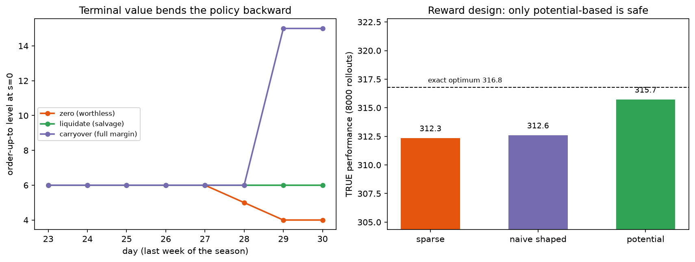

# Phase 2 — Lesson 2.9: Design Tradeoffs II — Reward & the End of Time

The second design lesson: two dials that define *what is being
optimized* rather than how big the model is. **Reward design** (what
signal the learner sees) and **terminal value** (what stock/goals are
worth when the horizon ends) both quietly redefine the optimum; only
one form of each is safe. Lesson 2.8 measured the resolution dials;
2.10 closes the trilogy with constraints and deployment.

Evidence: `docs/research/phase2_lesson9a_reward_design_evidence.txt`
and `...9b_terminal_value_evidence.txt` (live runs).
Demos: `phase2_mdp/lesson2_9a_reward_design.py`,
`phase2_mdp/lesson2_9b_terminal_value.py`.

## 1. Reward shaping — the signal vs the goal

Same inventory MDP, same Q-learning agent, three reward signals; every
learned policy is scored on the **true (sparse) reward** — the only
honest score:

*Left: the terminal convention bends the last week of the policy —
zero winds down (6→5→4), liquidate holds the useful level, carryover
jumps to the stock cap on the final days. Right: true performance of
the three trained policies against the exact optimum (dashed) —
potential-based lands nearest.*

| signal | true perf | greedy orders s=0..5 |
|---|---|---|
| sparse (true) | 312.35 | [6, 4, 4, 3, 1, 3] |
| naive shaped | 312.60 | [6, 4, 3, 5, 2, 2] |
| potential-based | **315.73** | [6, 5, 4, 2, 1, 0] |

Reference: exact sparse-optimal = **316.77**, orders [6, 5, 4, 3, 2, 1].

Reads: potential-based shaping (Φ(s) = −HOLD·stock, derived from a real
cost) lands nearest the exact optimum with nearly the same order table —
shaping sped learning **without moving the optimum**, exactly what the
invariance theorem (Ng, Harada & Russell 1999, *proven*) promises: only
potential-based shaping preserves the optimal policy. The naive shaped
run scores deceptively well on this seed, but its optimum is the
optimum of the *shaped* reward — the sales bonus makes holding look
cheaper than it is — a structural bias that on other seeds costs real
money. Sparse learns slowly (thin signal, slow credit assignment) but
never lies.

Rule of thumb: **shape through potentials derived from real costs,
never through invented bonuses.** And always score shaped-reward
policies on the true reward (the trap lesson 4.6's add-on A met again:
distributional heads whose own estimate flattered the model).

## 2. Terminal value — what is a unit worth at T?

Same 30-day season, three end-of-horizon conventions; the TRUE world
liquidates leftovers at 3.0 (70% off). Last-day order tables:

| convention | true perf | last-day orders s=0,3,..,15 |
|---|---|---|
| zero (fashion) | 581.85 | [4, 1, 0, 0, 0, 0] |
| liquidate (salvage) | **583.16** | [6, 3, 0, 0, 0, 0] |
| carryover (hoard) | 579.94 | [**15**, **12**, 9, 6, 3, 0] |

Reads: zero-terminal refuses last-day orders that are genuinely
profitable under salvage (leaves money). Carryover orders to the *cap*
on the final day because in-model leftovers are worth full margin —
then the true world liquidates them at a loss; **overoptimistic ends
are the expensive mistake**. Liquidation matches reality and orders
exactly while margin beats salvage. The distortion propagates backward:
a wrong end bends the whole late-season policy path, not just day T.

This is Chista's terminal-value task (end-of-season sell-through,
forced selling days 29–30) in miniature: the terminal value must answer
"what does one unit of stock REALLY fetch at T?" — the number the
optimizer is not allowed to invent.

## 3. The shared shape

Both dials are *invisible in the algorithm's own report*: the shaped
model and the hoarding model both converge happily to "optimal" — for
the wrong objective. The defense is the same for both: score against
an independent truth (true reward, true salvage), and prefer the
variant with an invariance guarantee when one exists.

## 4. Bridge

- Upstream: 2.2 (Bellman/V on the true reward), 2.6 (finite-horizon
  backward induction supplies the terminal-value slot).
- Downstream: 2.10 closes the trilogy — constraint vs penalty (the
  deployment dial) and precompute vs recompute (the MPC dial).
