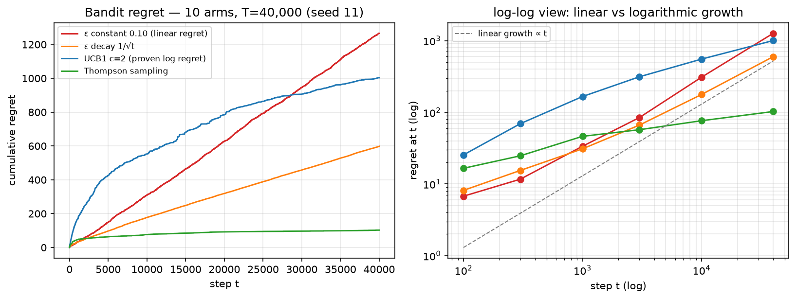
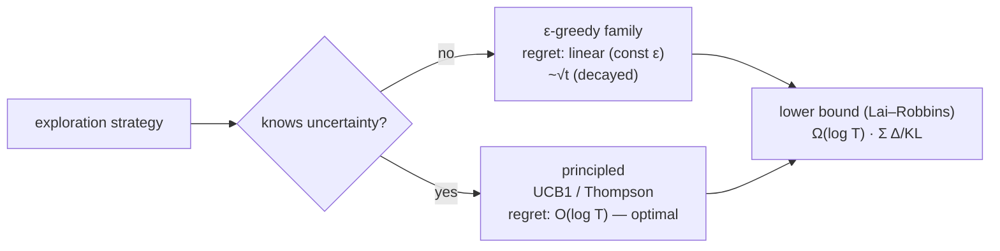

# Phase 3 — Lesson 3.5: Bandits — Regret Theory Without States

*Left: cumulative regret on linear axes — constant-ε climbs forever (~1,260),
Thompson flattens near ~100. Right: log-log view makes growth *rates* the
message — the dashed line is linear growth ∝ t; curves bending below it are
in the proven log-regret cone. Generated by `phase3_rl/make_figures.py`
(same seeds as the evidence run).*

Evidence: `docs/research/phase3_lesson5_bandits_evidence.txt` (live run, 2.3 s
total). Demo: `phase3_rl/lesson3_5_bandits.py`.

Strip the MDP down to one state and you get the **multi-armed bandit** — the
setting where exploration theory is *exact* and provable. Lesson 3.2
compared exploration heuristics inside an MDP; this lesson isolates the
dilemma so the regret theorems can be verified numerically.

## 1. Regret — the right way to grade exploration

`R(T) = T·μ\* − E[Σ r_t]` — rewards you *didn't* earn by not always pulling
the best arm. The proven landscape:

- **Lower bound (Lai–Robbins 1985):** any consistent policy has
  `R(T) ≥ log(T)·Σ_i (μ\*−μᵢ)/KL(μᵢ, μ\*)` — exploration is unavoidable and
  the unavoidable part grows **logarithmically**.
- **UCB1 (Auer 2002) achieves log(T)** — the bonus `c·sqrt(ln t / N(a))` is
  Hoeffding's inequality turned into a decision rule.
- **Constant-ε suffers linear regret** — it never stops pulling bad arms.

## 2. The live tournament (10 arms, T = 40k, seed fixed)

| policy | total regret | worst-arm pulls |
|---|---|---|
| ε const 0.10 | 1265.9 | 396 |
| ε decay 1/√t | 598.0 | 34 |
| UCB1 c=2 | 1003.4 | 93 |
| **Thompson** | **102.6** | **10** |

Three verified readings:
1. **Constant-ε = linear growth**: regret ×8 from t=10k → 40k (309→1266).
   Exactly what the lower bound forbids escaping.
2. **Thompson dominates on this instance**: sampling from Beta posteriors
   is near-optimal here (regret 102.6, log-consistent). Honest caveat: UCB1
   with c=2 pays a constant-factor penalty — the *rate* is what the theorem
   guarantees, not the constant. Tuning c matters in practice.
3. **Decayed-ε beats UCB1 here** — a reminder that on a *stationary* 10-arm
   problem, a well-decayed heuristic is strong; the theory's advantage
   (principled per-arm uncertainty) shows on harder instances.

## 3. The Lai–Robbins cone, verified

Suboptimal pulls of the two worst arms: 109 and 154 pulls at t=10k AND at
t=40k — flat, i.e. **logarithmic** (log2 t grew 13.3→15.3, ~15%). Compare
constant-ε's worst arm: 396 pulls and climbing linearly. The proven cone is
visible in raw counts.

## 4. Why this matters beyond bandits

- **A/B testing, price experiments, market probes**: every "try something
  new vs scale what works" is a bandit; Thompson = Bayes-optimal intuition,
  UCB = the audit-defensible frequentist rule.
- **Contextual bandits** (state re-enters as context, no long-term
  consequences) are the bridge back to full RL: same regret machinery, now
  conditional on context.
- UCB's bonus reappears in MCTS selection (`Q + c_puct·P·√ΣN/(1+N)`) —
  AlphaGo's tree is a bandit per node.

## 5. Key takeaways

- Regret is the honest currency of exploration: it converts "exploration
  is bad" into a measurable, optimizable number with proven limits.
- Log-growth policies (UCB1, Thompson) hit the proven optimum's *rate*;
  constants and heuristics decide practice.
- The bandit is the MDP with H=1 — everything here re-derives inside RL
  with credit assignment on top.

## Exercises

1. Sweep UCB1's c ∈ {0.5, 1, 2, 4}; plot regret(T=40k) — find the
   constant-factor sweet spot and explain via the KL gap μ\*−μ₁ = 0.012.
2. Two best arms nearly tied (μ = 0.70, 0.695): show Thompson's advantage
   SHRINKS (hard instances are hard for everyone — Lai–Robbins again).
3. Make arm rewards non-stationary (μᵢ drifts every 5k steps); verify that
   constant-ε *recovers* better than decayed-ε — when is "forever
   exploring" actually rational?
4. Implement the Gittins index for Bernoulli arms (discounted case) and
   check it dominates Thompson on this instance — the provably optimal
   answer you'll never use in production because it doesn't scale.
