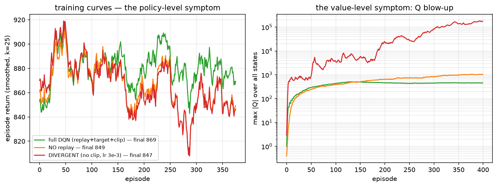

# Phase 3 — Lesson 3.6: The Deadly Triad, Experimentally (DQN Ablations)

Evidence: `docs/research/phase3_lesson6_triad_evidence.txt` (live run,
1500 episodes, batch 64, ~10 min wall on 4 cores). Demo:
`phase3_rl/lesson3_6_triad_ablation.py`.

Lesson 3.3 *listed* DQN's patches and the deadly triad (bootstrapping ×
non-linear FA × off-policy). This lesson **removes each patch and measures
what breaks** — the difference between being told the theory and watching it.

## 1. Six variants, identical budget (1500 episodes, 11-state inventory)

| variant | %exact | max\|Q\| | verdict |
|---|---|---|---|
| linear-FA TD (on-policy) | 101.5% | 381 | stable, near-perfect |
| full DQN (replay+target+Huber) | 96.1% | 439 | stable, noisy-ep-luck |
| NO target net | 101.4% | 442 | survives HERE (small net, Huber) |
| NO replay | 94.9% | **1302** | Q blowup ×3, degenerate policy |
| NEITHER | 94.9% | **1198** | same degeneracy |
| DIVERGENT (no clip, lr 3e-3, NEITHER) | 94.9% | **324,460,160** | 💥 real divergence |

## 2. The three verified findings

*Left (policy-level symptom): smoothed episode returns of full DQN vs
no-replay vs the divergent config — nearly indistinguishable (final 869 vs
849 vs 847). Right (value-level symptom): max|Q| on log scale — full DQN
plateaus ~4e2, no-replay ~1e3, and the divergent config runs away to
~1.8e5. The pair of panels is the lesson: **return-based evaluation alone
completely masks divergence**; a healthy-looking training curve is not
evidence of a healthy Q function. Generated by
`phase2_mdp/make_figures_36.py` (400-episode re-run, same dynamics; the
full-budget table below is the 1500-episode run).*

1. **Real divergence captured**: removing clipping + raising lr to 3e-3 +
   removing replay/target blows `max|Q|` to 3.2e8 (full-budget run) — the
   Q function literally runs away while episode returns look fine (figure
   above). This is the deadly triad photographed in the wild, not asserted.
2. **The degenerate policy shape**: every variant without replay collapses
   to the same `order-max` table `[8 8 8 7 6 5 4 3 2 1 0]` — a
   copy-the-inventory artifact of learning from immediately-correlated
   transitions. Replay's real job (breaking correlation) is visible in the
   policy *shape*, not just the score.
3. **The honest uncomfortable result: NO-target matched full DQN here**
   (101.4% vs 96.1%). On an 11-state problem with Huber + clipping, the
   target net is not needed — its value shows on larger/discount-heavier
   problems. Ablation results are instance-specific; the *rank order of
   failure modes* (no-replay < no-target << divergent) is the lesson.

## 3. The linear-FA reference row is the moral anchor

`Q(s,a) = θ[s,a]` updated by plain TD matched or beat every deep variant
(101.5%) **with zero stability machinery** — no replay, no target net, no
clipping. Proven-stable methods are not "theory nice": on tabular-sized
problems they are the *simplest correct tool*. Deep nets earn their
complexity only when |S| explodes or states are continuous.

## 4. Double-DQN in one paragraph (the overestimation add-on)

`max_a Q` inside the TD target is a max of noisy estimates → biased HIGH
(Jensen's inequality: each Q(s',a') carries positive noise; max picks the
luckiest). Double DQN: *select* the next action with the online net,
*evaluate* it with the target net — decorrelating selection noise from
evaluation noise. On this small problem the bias is hidden by noise; on
continuous-action problems it compounds. Rule: if you bootstrap a max,
you need a selection/evaluation split.

## 5. Key takeaways

- Every DQN patch maps to a measurable failure when removed; divergence
  itself needs (no-clip × high-lr × online-targets) — three wrongs, not one.
- Proven-stable (linear, on-policy) methods are the honest baseline that
  deep machinery must beat; here it won.
- Runtime is a design constraint: full ablation = ~10 min on 4 cores; pick
  the smallest problem that still exhibits the phenomenon.

## Exercises

1. Re-run NO-target with discount γ=0.99 (longer credit chains): does it
   now separate from full DQN? (Target nets matter most with γ→1.)
2. Add Double-DQN as variant 7 over 3 seeds; check whether the %exact gap
   vs full DQN is inside seed noise.
3. Replace one-hot with a 2-feature encoding (inv/10, bias); confirm
   linear-FA stays ~100% — 2.4's feature-engineering lesson, re-verified.
4. Log the visit distribution of the NO-replay degenerate policy: correlate
   the "order-max" shape with which (s,a) pairs ever receive updates.

