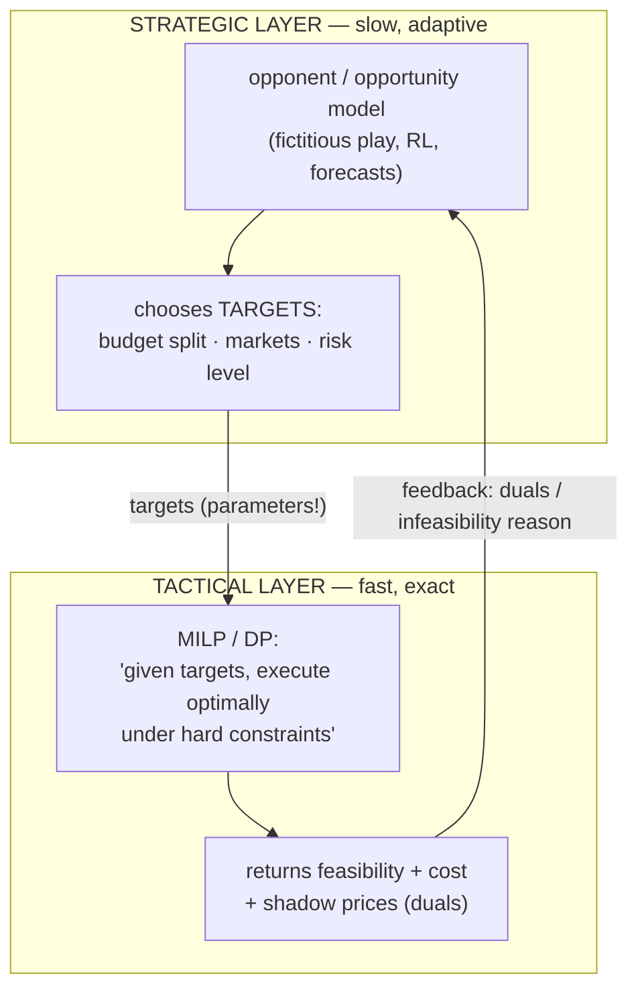

# Phase 4 — Lesson 4.3: Hybrid Architectures & Course Capstone

The culmination: combining all three pillars — **MILP (exact tactics) +
MDP/DP (sequential uncertainty) + RL/opponent models (adaptation)** — into
one working system, mirroring the architecture that industrial projects
(including Chista) actually use.

## 1. The canonical hybrid pattern



The same diagram in five lines: strategy **sets parameters**, tactics
**solve exactly inside them**, and the tactical layer's **dual variables
flow back** as the strategy's learning signal.

Why this decomposition works (and when it doesn't):
- **Value of decomposition:** the strategic problem is huge & adaptive
  (approximate methods shine); the tactical problem is small & rigid
  (exact methods shine). Each tool is used where it is provably strong.
- **The coupling variable** (lesson 1.3's shared capital!) is what makes
  the system one organism: strategy sets the budget, tactics report the
  shadow price of the budget back (LP duality!), strategy adjusts.
- **Failure mode:** strategic targets that are infeasible tactically.
  Lesson 1.3's infeasibility experience, now as an architecture concern:
  the tactical layer must return *why* (duals, conflict assumptions —
  CP-SAT's `SufficientAssumptionsForInfeasibility`).

## 2. The mini-capstone (built & run)

A trading-and-inventory firm over T days:
- **Strategic layer:** an MDP over (capital, market regime) — solved with
  Value Iteration *because the regime dynamics are known* — picks the
  daily **risk budget** (how much capital may be deployed).
- **Tactical layer:** a MILP — given today's risk budget, prices, and
  the opponent's observed behavior — allocates capital across 4 assets
  (continuous) + 2 warehouse openings (binary), maximizing return under
  the budget, sector caps, and fixed costs (every phase-1 technique).
- **Adversarial spice:** a rival bidder competes for one asset; the
  strategic layer tracks its behavior with fictitious play (lesson 4.2)
  and adjusts expected returns — closing the loop: **game theory feeds
  the MDP's reward, the MDP feeds the MILP's parameters, LP duals feed
  back.**

## 3. Design principles distilled from the whole course

1. **Model before method**: write the objective/constraints/Markov state
   first; the solver choice follows (lessons 1.2, 2.3).
2. **Exact where possible, approximate where necessary, honest always:**
   tabular DP > ALP/LFA > deep RL, in order of trustworthiness; use the
   strongest tool that fits the state space (lesson 2.4, 3.3).
3. **Duality is information:** LP duals price constraints; use them to
   couple layers and to explain infeasibility (lessons 1.4, 2.4).
4. **Exploration has provable cost; no-regret is the guarantee that
   survives adversaries** (lesson 3.2, 4.2).
5. **Test environments before agents** (lesson 3.1's signature bug!) and
   compare policies by evaluated performance, never by value magnitudes
   across horizons.
6. **Symmetry/tightness decide MILP speed**; **domains decide CP-SAT
   speed** (lessons 1.2b, 1.4c/d).

## 4. Run it

```bash
uv run python phase4_hybrid/lesson4_3_capstone_hybrid.py
```

## 5. Where to go next (references, not proofs)

- Puterman, *Markov Decision Processes* (the DP bible).
- Sutton & Barto, *Reinforcement Learning* (ch. 1–13 cover phases 2–3).
- Bertsekas, *Dynamic Programming and Optimal Control*.
- Nisan et al., *Algorithmic Game Theory* (ch. 1–4, 9 for this phase).
- Boyd & Vandenberghe, *Convex Optimization* (duality depth).
- For CP-SAT mastery: the OR-Tools docs + Perron's workshop slides.
