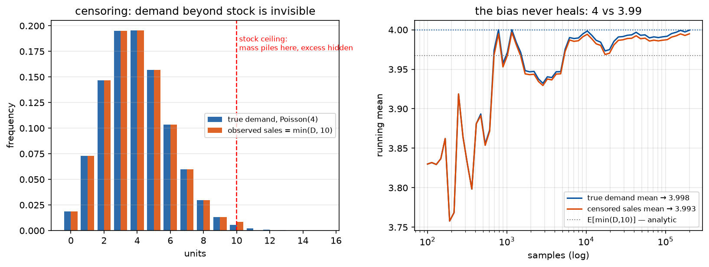

# Phase 4 — Lesson 4.5: POMDPs — Deciding Under Hidden State (Deep Dive)

The most complete treatment in this course. Partial observability is the
rule, not the exception, in real systems: the market's true regime, the
opponent's hand, the exact demand you *lost* because stock ran out — none
of it is on your screen.

## 1. The formal object

A **POMDP** = MDP + an observation layer that hides the state:

```
(S, A, T, R, Ω, O, γ)
S, A, T, R, γ : exactly as the MDP (lesson 2.2)
Ω             : set of observations (what you actually see)
O(o | s', a)  : observation model — P(seeing o | landed in s', took a)
```

Crucial mental shift: you do not *know* s; you receive evidence about it.
Examples:

| Domain | hidden S | observation Ω |
|--------|----------|---------------|
| trading | true market regime, others' intentions | prices, volume, fills |
| Kaggriculture | opponent's resources & plan | their visible actions on the board |
| inventory | true demand distribution | sales — but NOT demand when out of stock |
| poker | opponents' cards | bets, calls, folds |

The **inventory case is the canonical trap**: you observe sales
`min(D, stock)`. When stock = 0, demand is *censored* — you see 0 sales
whether nobody wanted anything or ten customers left. Naive estimation
from censored data systematically underestimates demand (a *proven*
statistical phenomenon — censoring bias), and policies built on it
chronically under-order.



*Censoring with Poisson(4) demand and a stock of 10. Left: the observed
sales histogram piles up at the stock ceiling while the demand mass above
10 is simply gone — not moved, gone. Right: the running mean of censored
sales converges to E[min(D,10)] ≈ 3.996, not λ = 4; the gap is small here
because the ceiling is far in the tail, and **that is exactly the trap** —
at realistic stock levels the bias hides inside noise while never healing.
Generated by `phase2_mdp/make_figures_45.py` (seeded).*

## 2. Belief states — the theorem that makes POMDPs tractable

Define `b(s)` = your probability distribution over the hidden state given
all history. After acting with `a` and observing `o`:

```
b'(s') ∝ O(o | s', a) · Σ_s T(s' | s, a) · b(s)          (Bayes filter)
```

**The foundational theorem (Åström 1965, proven):** the belief process
`b_t` is itself a **fully-observable Markov process**. The POMDP over S
is equivalent to an MDP over the *belief space* — a simplex of
distributions. Therefore:

- every phase-2 tool (Value Iteration, Policy Iteration, LP formulation)
  applies unchanged — but over a *continuous* state space b ∈ Δ(S);
- Bellman becomes `V(b) = max_a [ Σ_s b(s)R(s,a) + γ E_{o|b,a} V(τ(b,a,o)) ]`
  where τ is the Bayes filter above;
- **information has value and can be priced**: the expected value of an
  observation is `E_o V(τ(b,a,o)) − V(b)` — the theoretical basis for
  paying for market data, sensors, or information gathering actions
  (active sensing / "value of information", *proven* non-negative for
  optimal policies).

Two *proven* properties worth knowing:
1. Belief updates are exact Bayesian posterior updates — no approximation
   in the filter itself.
2. Optimal POMDP policies are **piecewise-linear and convex (PWLC)** in b
   for finite-horizon problems (Smallwood & Sondik 1973) — the value
   function is a finite set of hyperplanes over the simplex. This is why
   exact solvers can enumerate α-vectors at all.

## 3. The three families of solution methods

### (a) Exact — Value Iteration on belief space
Enumerate α-vectors (hyperplanes); backup = pointwise max. Exact but
doubly-exponential in horizon. Use only for tiny S, Ω.

### (b) Point-Based Value Iteration (PBVI / SARSOP / PomdpSolve)
The insight (**proven error bounds**): you never need V on the whole
simplex — only on the beliefs you will actually *reach*. Sample a
reachable belief set, back up α-vectors only there. SARSOP targets the
beliefs on the optimal trajectory. Industrial-grade open source:
`pomdp-solve`, `SARSOP`. This is the right tool when S is small enough to
enumerate but too big for exact VI.

### (c) Memory-based RL (the practical default)
When S is huge/continuous, skip belief computation entirely: feed the
agent a *history window* or an RNN/LSTM/Transformer over observation
history and let it learn its own internal state. Key points:
- theoretically justified: a recurrent policy over observation history
  can represent any belief-policy (**proven expressiveness result**);
- practically: frame-stacking (Atari), LSTM policies, or GRU world models;
- the hidden cost: **partial observability + function approximation is
  the triad, amplified** — recurrent RL is *harder* to stabilize than
  plain DQN (R2D2's stored-state tricks exist for a reason).

### Choosing between (b) and (c) — the decision rule
- S finite and small (≤ a few hundred), Ω discrete: **PBVI/SARSOP** —
  you get *optimality certificates* (lower/upper bounds that meet).
- S continuous or huge, or a simulator exists: **memory-based RL**.
- Need *interpretability* of uncertainty (finance!): belief tracking +
  planning — the belief vector IS a risk dashboard.

## 4. The miniature problem — censored-demand inventory (POMDP)

Phase-2's inventory MDP, but now you only observe `sales = min(D, stock)`.
When stock hits 0, the true demand is hidden. Two agents:
1. **Naive MLE agent**: estimates λ from observed sales directly (biased
   low — it never sees lost demand), then plans with VI on the estimated
   model.
2. **Belief agent**: maintains a belief over λ using the *censored*
   likelihood `P(sales=k | λ, stock) = P(D=k) if k<stock; P(D≥stock)
   if k=stock` — i.e., a zero-sales day at zero stock is *evidence of
   high demand*, not low. Updates a posterior on λ each day (Bayes),
   plans with VI over (stock, belief-summary).

Prediction: the belief agent orders more, stocks out less, and earns
more — because it understood what the silence of the stock-out meant.
This single phenomenon (censoring bias) explains a large share of
real-world "my RL/inventory system under-orders" complaints.

## 5. Run it

```bash
uv run python phase4_hybrid/lesson4_5_pomdp.py
```

The script: (a) implements the Bayes filter on λ and verifies belief
convergence against the true λ; (b) runs both agents head-to-head on the
same demand stream; (c) demonstrates the belief-value curve — how much
the belief agent's advantage shrinks as censoring decreases (bigger
stock ⇒ less hidden information ⇒ agents converge: information value
dies out exactly as theory says).

## 6. Key takeaways

- POMDP = MDP + observation model; the *belief MDP theorem* (proven)
  converts it back into a problem your phase-2 toolbox can attack.
- Belief tracking is exact Bayes — uncertainty is a state variable you
  compute, not a nuisance you ignore.
- Censoring (unobserved demand, unfilled orders, absent events) is the
  most common hidden-state trap in business data; belief methods fix it,
  naive statistics silently break on it.
- Choose exact/PBVI for small discrete problems (certificates!), memory-
  based RL for large ones; in finance the belief itself is a deliverable
  (risk view), not just an internal variable.
- **Proven results cited:** Åström's belief-MDP equivalence (1965);
  PWLC value functions (Smallwood–Sondik 1973); PBVI error bounds;
  non-negativity of optimal value of information; censoring bias in
  demand estimation; recurrent-policy expressiveness for POMDPs.
