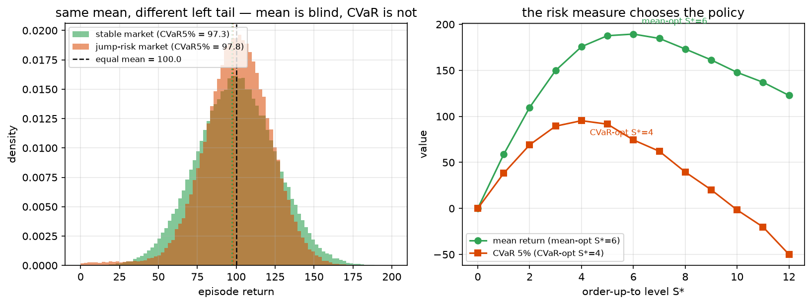

# Phase 4 — Lesson 4.6: Risk-Sensitive & Distributional Decision Making

The complete treatment of "beyond the mean". Everything in phases 2–3
optimized `E[Σ γᵗ rᵗ]` — the *expectation* of the return. The expectation
is one functional on the return distribution; risk management is the
study of the others. This lesson maps the whole landscape: which
risk measures keep dynamic programming alive, which break it, and how
Distributional RL replaces the question "what is my expected return?"
with "what is my *return distribution*?" — after which every risk measure
becomes a read-out, not a re-training.

## 1. Why the mean is dangerous (the motivating failure)

Two policies with identical `E[G]`:
- **A**: earns +5 every day, forever.
- **B**: earns +104 one day in 20, loses −1 the other 19 days.

Same mean (+4.2/day-ish); opposite businesses. A retiree, a hedge fund
with a drawdown covenant, and a clearinghouse must prefer A; a growth
fund might prefer B. The mean cannot express this difference —
**the whole distribution can**. In finance this is not philosophy:
regulators *mandate* VaR/CVaR reporting, and maximize-the-mean silently
violates both.

## 2. The catalog of return functionals

Let `G` = (discounted) return, `F_G` its distribution. The objective is
always `maximize ρ(G)` for some functional ρ. The catalog:

### 2.1 Mean–variance (Markowitz, made sequential)
`ρ(G) = E[G] − λ·Var[G]`

- The static version is portfolio theory (1952). The *sequential* version
  is treacherous: **variance is not additive over time** (Var of a sum ≠
  sum of variances when terms are dependent), so the Bellman equation
  does not close on a scalar V. Workarounds exist (mean–variance over
  *per-step* rewards; augmented state with running EMA of variance), but
  none is clean. Status: **use with caution; DP theory is broken here.**

### 2.2 CVaR — the regulator's measure
`CVaR_α(G) = E[G | G ∈ worst (1−α) tail]` (α typically 0.95/0.99)
equivalently the optimal value of the Rockafellar–Uryasev program:
`min_z { z + (1/α)·E[(G − z)⁻] }`

- Coherent (**proven**: sub-additive, monotone, translation-invariant,
  convex — Artzner et al. 1999). VaR is NOT coherent; CVaR is the
  principled repair of VaR.
- Sequentially: **CVaR is time-inconsistent** — the CVaR-optimal policy
  for the whole horizon is not the CVaR-optimal policy for the remaining
  horizon (*proven*). Honest options:
  1. **CVaR of the *static* return distribution** (evaluate full-episode
     G, pick the policy whose empirical-tail mean is best — what our demo
     does): simple, honest, no DP claims.
  2. **Markovian CVaR composition** (nested/conditional CVaR): recursively
     apply CVaR at each step — coherent AND time-consistent (**proven**,
     Ruszczyński 2010), computable with a DP where the state is augmented
     with the running CVaR level `z_t`. This is the correct dynamic object.
  3. Distributional RL (§4): learn Z, compute any CVaR afterward.

### 2.3 Exponential utility — the only clean dynamic family
`ρ(G) = −(1/θ)·log E[exp(−θG)]`, θ > 0 risk-averse.

- **The miracle (proven):** the entropy-like structure *is* dynamically
  consistent — Bellman survives, in the multiplicative form
  `V(s) = −(1/θ)·log Σ_{s'} P(s'|s,a)·exp(−θ·(r + V(s')))` per action.
  Risk-sensitive VI/PI converge under the same contraction logic
  (in the duality-transformed space).
- θ→0 recovers risk-neutrality (Taylor expansion); θ↑ crushes the tail.
- In LQR this becomes exactly **H∞ control** — robust control and
  risk-sensitive DP are the same theorem in two costumes.

### 2.4 Robust MDP — worst case over models
`max_π min_{P ∈ 𝒰} V^{π}_P`, uncertainty set 𝒰 around the estimated P
(e.g. all P within L1 distance δ, or box/ellipsoidal sets).

- Reads: "be good under EVERY transition kernel I cannot rule out."
- Connection to lesson 4.1: this is minimax — but against *nature's
  ambiguity*, not an opponent. Equivalent to a zero-sum game where the
  adversary picks P from 𝒰 each step.
- **Proven:** for rectangular uncertainty sets (per-state-set, no
  inter-state coupling) the robust Bellman equation holds and robust VI
  converges; optimal policies are stationary. Non-rectangular sets are
  in general intractable — rectangularity is the price of dynamic
  programming.
- Finance reading: stress-testing. 𝒰 = "all models consistent with data
  AND surviving my stress scenarios"; the robust optimum is the policy
  that survives every stress.

### 2.5 Chance constraints (CMDP flavor, lesson 2.3)
`max E[G] s.t. P(G < L) ≤ δ` — solved exactly by LP over occupancy
measures (lesson 2.4) or Lagrangian reward shaping `r − μ·1[loss]` with
μ tuned to the boundary of the constraint (the dual λ from lesson 1.4
*is* the fair price of risk).

### 2.6 Bayesian / epistemic uncertainty
The "Bayesian network" idea from the discussion: put a **posterior over
models** (P, R or their parameters) rather than a point estimate:
- **Bayes-Adaptive RL**: augment state with the posterior → belief MDP
  (lesson 4.5's machinery verbatim);
- **Posterior/Thompson sampling**: act greedily w.r.t. a model *sampled*
  from the posterior each episode — exploration (lesson 3.2) and
  epistemic risk in one mechanism;
- **Bayesian ensembles / dropout nets** in deep RL: approximate
  posterior over Q-functions; disagreement = epistemic uncertainty,
  reported *separately* from aleatoric noise.
- Distinguish (**proven distinction, not pedantry**): *aleatoric*
  uncertainty (the environment IS random: Poisson demand) vs *epistemic*
  (I don't know λ yet). Distributional RL models the first; Bayes/robust
  methods the second. Conflating them is a category error that produces
  overconfident systems.

## 3. Distributional RL — learn the distribution once, price risk forever

### 3.1 The object
Instead of `Q(s,a) ∈ ℝ`, learn the random return `Z(s,a) ~ 𝒵(·|s,a)`:
`Q(s,a) = E[Z(s,a)]` is then just one statistic of a learned object.

### 3.2 C51 (Bellemare, Dabney, Munos 2017)
Discretize the return range into N=51 atoms `z_i = Vmin + i·Δ`, and learn
a categorical distribution `p_i(s,a)`:
- **Distributional Bellman operator**:
  `T Z(s,a) := D_r + γ Z(S', argmax_{a'} E[Z(S',a')])`
  (the *distributional* shift-and-mix, then project back onto the fixed
  atoms by the **Cramér projection** — clip to [Vmin,Vmax], linearly
  redistribute probability mass onto neighboring atoms).
- **Proven**: the distributional Bellman operator is a γ-contraction in
  a suitable (Cramér) metric on distribution spaces; the contraction is
  *strictly stronger* than the expectation-level one — an early hint that
  learning the distribution is not merely cosmetic.

### 3.3 QR-DQN — quantile regression (the practical upgrade)
Instead of fixed uniform atoms, learn N quantile locations `θ_i(s,a)` with
the **quantile regression loss** (pinball loss):
```
L_i = E[ ρ_τi (G − θ_i(s,a)) ],  ρ_τ(u) = u·(τ − 1[u<0]),  τ_i = (2i−1)/2N
```
- Uniform coverage of the whole distribution without choosing [Vmin,Vmax];
  the i-th head literally IS the τ_i-quantile of the return → **CVaR is a
  linear combination of quantile heads, read directly off Z** (§2.2's CVaR
  becomes a lookup, not an optimizer); also: **mean over the worst heads**;
  no re-training to switch risk measure.



*Why the risk measure picks the policy. Left: two return distributions
with the **same mean** (dashed) but different left tails — the green
stable market and the orange jump-risk one. The mean cannot tell them
apart; the dotted CVaR5% lines are far apart. Right: the lesson's own
grid scan over the order-up-to level S\* — the mean-optimal policy orders
up to 6, the CVaR-optimal policy only up to 4: a risk-aware operator
deliberately gives up average profit to shrink the bad tail. Generated by
`phase2_mdp/make_figures_46.py` (re-runs the lesson's seeded grid).*

### 3.4 Why distributional works even when you don't care about risk
(**Empirically robust finding**, theory still partial): the distributional
target is a *richer learning signal* — per-atom targets propagate value
information at multiple return levels simultaneously, empirically
stabilizing deep networks. C51 beat DQN on Atari with a risk-NEUTRAL
policy — the distribution was useful as scaffolding even when the
decision rule ignored it.

### 3.5 Using the learned distribution for risk
Given learned quantile heads θ_1..θ_N (τ ascending):
- `VaR_α = θ_{⌈αN⌉}`
- `CVaR_α = (1/(1−α))·Σ_{τ_i > α} θ_i·Δτ` (tail mean of quantiles)
- mean–variance: from E[Z] and Var[Z] (variance of the discrete
  representation)
- robust policy: act on min over an ensemble of distribution heads.
One training run → every risk measure available at read-out. **This is
the practical answer to your question.**

## 4. The mini-experiment (script)

**Add-on A — mini QR-DQN (`lesson4_6a_qrdqn.py`, ~3.5 min):** trains a
9-quantile-head network on the inventory env (pinball loss, random-tau
one-step distributional Bellman) and reads mean / VaR5% / CVaR5% directly
off the heads. Live run: heads are monotone in tau (381 → 779), CVaR is a
pure lookup — the §3.5 promise works. **Honest finding:** the head values
*overestimate* the empirical rollout distribution (mean 640 vs 302, CVaR
381 vs 217) — the classic DQN overestimation bias (lessons 3.6/4.7)
compounded by distributional training; the SHAPE (monotone heads, tail
below mean) is right while the calibration is not. Distributional RL
fixes *what you can express*, not *whether your network lies*. Calibration
needs Double-Q-style selection/evaluation (exercise) and more data.

`phase4_hybrid/lesson4_6_risk_sensitive.py` — the inventory problem,
three planners on the SAME demand stream:
1. **Risk-neutral VI** (phase-2 baseline);
2. **CVaR-VI** via the nested/Markovian CVaR recursion (Ruszczyński) —
   state augmented with the running CVaR level; compare order policies;
3. **Robust VI** with a box uncertainty set on λ (λ ∈ [λ̂−δ, λ̂+δ] and
   the worst pmf in the set per state) — the stress-tested policy;
4. **Empirical CVaR read-out** of each policy's full-episode return
   distribution (5% tail) — showing: the risk-neutral policy has the best
   mean but the worst tail; CVaV/robust policies trade a little mean for
   a much better tail; and a **QR-style quantile table** computed from
   Monte-Carlo rollouts of each policy (the distributional read-out done
   model-free).

## 5. Run it

```bash
uv run python phase4_hybrid/lesson4_6_risk_sensitive.py
```

## 6. Key takeaways

- `E[G]` is one point in a space of functionals; regulators and risk
  realities live elsewhere in that space.
- **Dynamic-programming survival guide:** exponential utility ✓ (proven
  consistent), nested CVaR ✓ (with augmented state), robust with
  rectangular sets ✓, mean–variance ✗ (not additive), static CVaR ✓
  (no DP claims, empirical tail).
- Distributional RL (C51/QR-DQN) learns Z once; VaR/CVaR/quantiles/
  variance become read-outs. The distributional Bellman operator is
  *provably* a stronger contraction — richer signal, not just risk.
- Aleatoric ≠ epistemic: distributional methods model the first,
  Bayesian/robust methods the second; production systems need both,
  reported separately.
- **Proven results cited:** coherence of CVaR (Artzner et al. 1999);
  time-inconsistency of static CVaR vs consistency of nested CVaR
  (Ruszczyński 2010); convergence of risk-sensitive/exponential DP;
  robust VI convergence under rectangularity; distributional Bellman
  contraction (Rowland et al. 2018); potential-based shaping precedent
  for honest augmentations.
