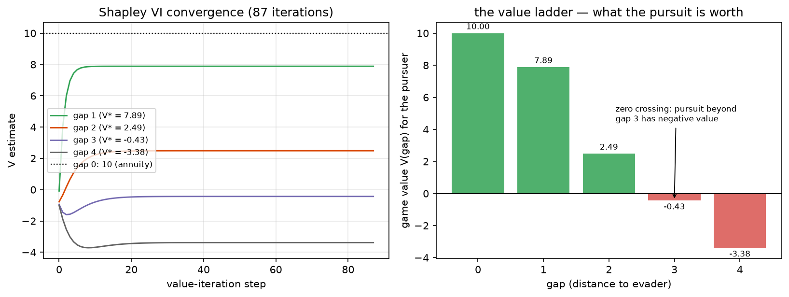

# Phase 4 — Lesson 4.8: Markov Games & Learning Opponents

Evidence: `docs/research/phase4_lesson8_markov_games_evidence.txt` (live run).
Demo: `phase4_hybrid/lesson4_8_markov_games.py`.

Lessons 4.1–4.2 treated competition as one-shot or repeated stage games;
lesson 2.3 *named* the stochastic game and cited Shapley 1953 but never ran
it. This lesson opens the object formally — and it is the most direct
mathematical description of Kaggriculture/Chista in the whole course.

## 1. The formal object (2-player zero-sum Markov/stochastic game)

```
states S (board position), actions A¹, A² (both move simultaneously)
transition: s' ~ P(· | s, a¹, a²)     ← BOTH moves inside the kernel
rewards: r¹(s,a¹,a²) = −r²(s,a¹,a²)   (zero-sum)
discount γ
```

The single structural difference from an MDP: **the transition kernel
contains the opponent's action.** Everything downstream changes shape:
Bellman's `max_a` becomes `max_{a¹} min_{a²}` (worst-case opponent) or
`max_{a¹} E_{a²~opp}` (model the opponent, lesson 4.2's route).

## 2. The miniature — Shapley pursuit (1953, miniaturized)

Pursuer vs evader on a track, gap g ∈ {0..4}; both move simultaneously;
the evader stumbles w.p. 0.25 (move randomized); adjacent ⇒ catch w.p.
0.35; caught = +1 annuity for the pursuer (zero-sum).

**Shapley value iteration** `V(g) = max_ap min_ae E[r + γV(g')]` converges
in 87 iterations to `V = [10, 7.886, 2.488, −0.433, −3.383]` — monotone in
the gap, V(3) crossing zero: *pursuit beyond distance 3 has negative
value*. **Proven (Shapley):** discounted zero-sum stochastic games have a
stationary minimax value and this VI converges to it. The max-min nesting
does NOT break contraction — that is the theorem.

Equilibrium policies are pure here (both chase/flee at full speed), which
the fictitious-play experiment then rediscovers from *interaction alone*.



*Left: the max-min value estimates per gap over VI iterations — every
curve settles within ~20–30 steps (the loop runs to 87 for the tolerance);
the max-min nesting preserves contraction. Right: the converged value
ladder — positive (green) while the pursuit is winnable, negative (red)
beyond gap 3. Generated by `phase2_mdp/make_figures_48.py` (same game,
same seed as the lesson run).*

## 3. Markov fictitious play — learning the opponent per state

Each player keeps **per-state action frequencies of the other** and
best-responds through the known dynamics. Result: policy drift from the
computed equilibrium = 0.000 from round 1 (pure strategies, immediately
identified). Two honest caveats the experiment surfaces:

1. **The easy case.** With separated payoffs the argmax is unique and
   stable — FP "converges" trivially. The interesting cases are mixed
   equilibria (matching-pennies-like states), where FP cycles *around* the
   equilibrium rather than landing on it — still inside the convergence
   guarantee for zero-sum, but not monotone.
2. **Indexing bug as pedagogy.** My first FP implementation let the evader
   best-respond over the *pursuer's* action index — it "evaded" by +1
   (toward the pursuer) forever, drift stuck at 0.8. An opponent-model bug
   looks exactly like a stubborn opponent. Testing drift-against-known-
   equilibrium is what exposed it.

## 4. The mapping to Kaggriculture / Chista

| Markov-game object | Chista counterpart |
|---|---|
| state s | board (tiles, resources, both fleets) |
| A¹, A² (simultaneous) | both agents submit moves each step |
| P(s'|s,a¹,a²) | env rules + opponent's policy |
| zero-sum? | *approximately* — rank-based scoring is constant-sum-ish per match |
| FP frequency table | the opponent-prediction module |
| best response via planning | the MILP tactical layer (lesson 4.3) |

What the theory says and does not: in the zero-sum discounted world,
best-responding to a well-estimated opponent converges toward minimax
play (safe by construction). Kaggriculture is *nearly* zero-sum and
*episodically* repeated — close enough that the opponent-model +
planner architecture (4.3) is the right first-order design, far enough
that no-regret guarantees (4.2) do not transfer verbatim.

## 5. Key takeaways

- Markov game = MDP whose kernel includes the opponent. One structural
  change, and every algorithm re-derives with max→max-min.
- Shapley VI is the exact solver; Markov fictitious play is the
  model-free route — and per-state opponent frequencies are the minimal
  sufficient statistic for it.
- Zero-sum buys convergence guarantees; general-sum buys nothing of the
  sort (4.2's proven gaps) — know which world you are in before
  trusting self-play.
- The FP-indexing bug is the meta-lesson: an opponent-model error is
  indistinguishable from opponent behavior unless you hold a reference
  equilibrium to diff against.

## Exercises

1. Make the evader faster (moves ±2, pursuer ±1): show the value collapses
   to −10 at every g ≥ 1 (pursuit is hopeless — compute, don't assume).
2. Add a mixed-equilibrium state (symmetric catch probabilities) and watch
   FP cycle around the equilibrium instead of converging; plot the policy
   trajectory.
3. Replace the minimax opponent with the frequency-weighted (expected)
   opponent in Shapley VI — when do the two policies differ? (This is the
   robust-vs-adaptive boundary of lesson 2.3 Axis 6.)
4. Two learners, neither knows V: implement Nash Q-learning on this game
   and compare its V estimate against Shapley VI's exact values.
