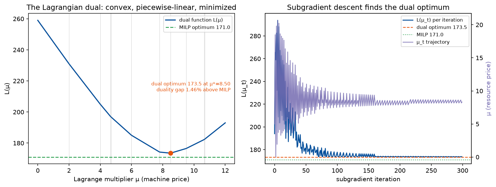

# Phase 1 — Lesson 1.9b: Nonlinear Masters — Column Generation beyond the LP Master

Evidence: `evidence/phase1_lesson9b_nonlinear_masters_evidence.txt`
(live run). Demo: `phase1_milp/lesson1_9b_nonlinear_masters.py`.

Lesson 1.9's master is an LP; 1.10's is integer over columns. This lesson
answers the question both leave open: **what happens when each column's
contribution to the master is nonlinear in "how much of it you take"?**
The honest answer, measured three ways: column generation survives as a
*mechanism*, but the pricing certificate changes shape — and for concave
masters it changes into something you must not trust blindly.

## 1. Convex master — congestion pricing, KKT replaces LP duality

Blocks pick plans; total machine-hours `P` incur a convex congestion
cost `(ρ/2)P²`. The master is a convex QP, so "duals" come from the
**KKT system**, not LP duality. CG becomes: price each block's plans
with the gradient-adjusted cost `c_p + ρ·P·m_p`, take per-block argmins,
update `P`, repeat. Live result on a 2×25 instance:

- enumeration (all 625 pairs): 64.2000, plans (20,16), P=4
- CG with KKT pricing: **64.2000** — identical, gap 0.00e+00 (asserted)
- KKT check: per-block reduced costs ≥ 0, zero exactly at the chosen
  plans — the certificate that LP duality used to provide

The envelope `F(P)` (best plan pair as a function of P) is piecewise
with **plateaus** — any minimizer is optimal; the printout shows the
plateau explicitly. Exactness survives convexity; only the certificate
changes (reduced cost → KKT stationarity).

## 2. Concave master — the secant trap, measured

Capacity purchase with fixed charge `f(k) = F·1[k>0] + c·k` (F=30,
c=4, K=20). Two demands, both live:

- demand 10: integer optimum f(10) = **70.00**; LP over level columns =
  **55.00** (−21.4%) using a *fractional* mix `(20, 0.5)`
- demand 10.5: integer f(11) = **74.00**; LP = **57.75** (−22.0%)

The LP "price" fails twice, measurably: the **fixed charge is split
fractionally** across the mix (under-bidding the true cost), and between
knots the implied per-unit price is the **secant slope** — chord(0,20) =
5.50/unit vs the true marginal 4.00/unit. Remedies, in course order:
keep the master integer and branch (B&P, 1.10), perspective
reformulation (Frangioni–Gentile) which restores the convex hull, or
discretize usage levels into separate columns and pay the size.

## 3. Lagrangian relaxation — the coupling that kills separability

Two blocks of 10 jobs share one machine of capacity 14 (plus block-local
count caps). The coupling row breaks block-diagonality, so DW does not
apply. Relax it with multiplier μ ≥ 0: each block solves its own
count-capped selection on reduced profits `p − μ·a`; the dual function
`L(μ) = μ·CAP + Σ_b max(...)` is convex piecewise-linear and is
**minimized** by subgradient descent. Live:

- direct MILP: 140.0 (uses exactly 14.0)
- Lagrangian dual best bound: **141.25 → duality gap 0.89%**
- best feasible from repair: 121.0 → optimality gap 13.57%
- 300 subgradient iterations, μ\* ≈ 6.43 (the machine's shadow price)

**Methodological correction kept in the evidence:** the first version
*maximized* L(μ) — the wrong direction — and reported a useless 39% gap.
The Lagrangian dual of a ≤-relaxed maximization is **minimized**; after
fixing the sign, the bound dropped from 195 to 141.25. μ is the shared
machine's price; the block-local rows stay inside the subproblems —
that is exactly what "keep the relaxation separable" means. This is the
Chista opponent-model shape: price the shared resource, let blocks
decide locally, measure the bound.

## 4. The decision table (now complete across 1.9/1.9b/1.10)

- linear column contribution → LP master, pricing by LP duality,
  certificate = reduced costs (1.9)
- fixed-charge / integer contribution → MILP master, pricing by LP duals
  per node, certificate = branch & bound (1.10)
- convex contribution → convex master (QP/SOCP), pricing by KKT
  multipliers, certificate = KKT stationarity (this lesson, verified)
- concave contribution → do NOT trust LP prices (secant trap, measured
  here); use integer master / perspective / discretized levels
- non-separable coupling → no DW at all; Lagrangian relaxation with
  subgradient μ, certificate = the dual bound + measured gap (this
  lesson)

## 5. Bridge

- Upstream: 1.4 (duals as prices), 1.9 (the CG loop), 1.10 (integer
  masters and branching on columns).

*Left: the dual function L(μ) — convex, piecewise-linear, minimized at
μ\*≈8.5 giving bound 173.5, only 1.46% above the MILP optimum 171.0
(dashed). Right: the subgradient walk — L(μ_t) oscillates with decaying
amplitude while the price μ_t settles at μ\*. The figure uses its own
seeded instance (the lesson script's part-c draw differs; both are in
the evidence).*
- Downstream: 2.10's CMDP shadow price is the MDP-side twin of μ here;
  4.3's hybrid capstone prices the shared tactical budget exactly this
  way; 4.2's fictitious play is a best-response loop with the same
  block-separable structure.
- Exercises: (1) swap part (c)'s count caps for true knapsack caps per
  block and re-measure the gap; (2) in part (b), implement the
  perspective reformulation and verify it recovers the integer optimum's
  cost at fractional demand; (3) part (a): two shared resources → KKT
  with a 2-D multiplier vector; does per-block pricing still converge?
